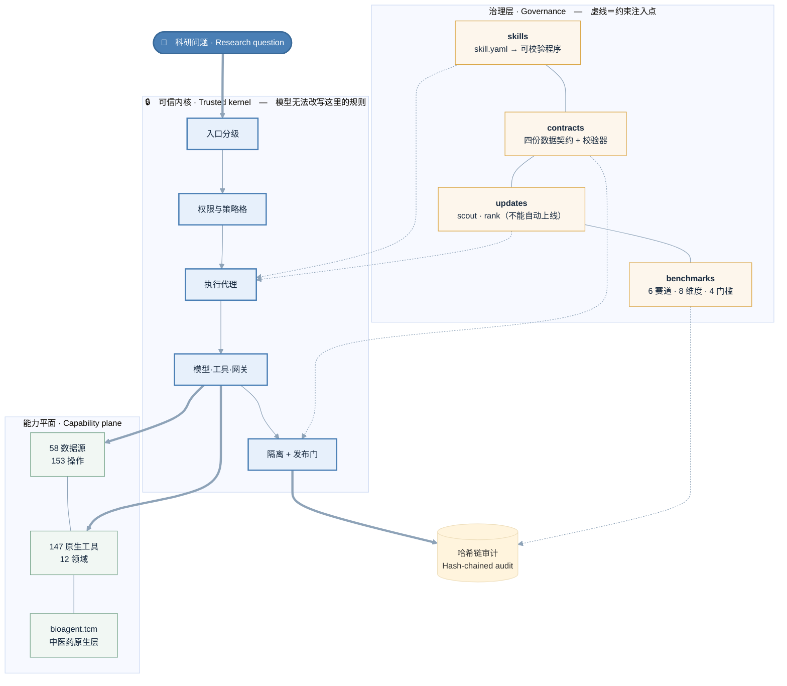
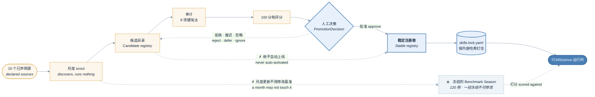

<div align="center">

# TCMScience

### The first governed autonomous research agent for Traditional Chinese Medicine

### 全球首个面向中医药的受治理自主科研智能体

*The model may reason. It does not define the laws of the laboratory.*

**让语言模型推理，但不让它定义实验室的法则。**

## Authors · 作者

**康砚澜** Yanlan Kang <sup>1,†</sup> &nbsp;·&nbsp; **刘瑞琦** Ruiqi Liu <sup>2,†</sup> &nbsp;·&nbsp; **许帅** Shuai Xu <sup>3,*</sup> &nbsp;·&nbsp; **张绪坤** Xukun Zhang <sup>4,*</sup> &nbsp;·&nbsp; **[朱正忠](https://www.sciopen.com/scholar/info?id=1952658822209773569) William Cheng-Chung Chu** <sup>5,*</sup>

<sub>

1. Institute of Medical Philosophy & Future AI (IMPF-AI) · 医学哲学与未来人工智能研究所
2. Shanghai Medical College, Fudan University · 复旦大学上海医学院
3. Shanghai Ziranerran Traditional Chinese Medicine Foundation · 上海自然尔然中医药基金会
4. Li Ka Shing Faculty of Medicine, The University of Hong Kong · 香港大学李嘉诚医学院
5. Fuyao University of Science and Technology · 福耀科技大学

</sub>

<sup>†</sup> These authors contributed equally · 同等贡献 &nbsp;&nbsp; <sup>*</sup> Co-corresponding authors · 共同通讯作者

[](https://github.com/rachael1216/TCMScience/actions/workflows/ci.yml)
[](https://opensource.org/licenses/MIT)
[](https://www.python.org/downloads/)


[](https://rachael1216.github.io/TCMScience/)


</div>

---

## ⚡ Try it in 30 seconds · 30 秒跑起来

**No install, no configuration, no API key, no network.**

<!-- zh -->
**不需要安装、不需要配置、不需要 API key、不联网。**

```bash
cd BioScience-Harness
python examples/run_skills.py
```

It prints the complete result of all four TCM skills, including each one's **stated limitations** and its **publication-gate ruling**:

<!-- zh -->
输出四个中医药 Skill 的完整结果，包括每个的**局限声明**和**发布门裁决**：

```
5/5 artifacts passed the publication gate
```

**That is the whole of it.** For the fuller install and invocation paths, jump to [Install](#-install--安装) or read [INSTALL.md](INSTALL.md) / [USAGE.md](USAGE.md).

<!-- zh -->
**这就是全部。** 想看更详细的安装与调用方式，跳到 [安装](#-install--安装) 或读 [INSTALL.md](INSTALL.md) / [USAGE.md](USAGE.md)。

---

## Evaluation site · 评测网站

**https://rachael1216.github.io/TCMScience/** — the public Arena: leaderboards,
benchmark registry, skill registry, run traces and methodology.

<!-- zh -->
**https://rachael1216.github.io/TCMScience/** —— 公开评测平台：排行榜、基准注册表、
技能注册表、运行 trace 与方法论说明。

The site is read-only and static: it renders published result bundles and never
computes a score, so compromising it cannot compromise a result.

<!-- zh -->
该站点只读且为静态：它只渲染已发布的结果包，**永不计算分数**，因此攻破它也无法影响评测结果。

---

## What「first」concretely means · 「全球首个」具体指什么

A bare「first」is unfalsifiable, so we break the claim into four that **can each be checked off one by one**:

<!-- zh -->
笼统的「首个」不可证伪，所以我们把主张拆成四条**可以逐条核对**的：

| # | Claim | Why it did not exist before |
|---|---|---|
| **1** | The first research agent to make **TCM evidence types** into a type system whose members cannot collapse into one another | Every prior medical agent treated evidence as text or as a single ordinal grade. In Chinese medicine,「classical record」,「processing differences」,「eighteen incompatibilities」and「RCT」are different kinds of evidence; conflating them turns an ancient textual record into clinical evidence |
| **2** | The first system in which **a computational prediction cannot impersonate a clinical fact at the type level** | Network pharmacology (NP) outputs predicted relations, yet the literature routinely phrases them as "mechanism of action". We made it a **type constraint** in the kernel: in the design table, predictive evidence appears in exactly one row, `MECHANISTIC`, and can never support `CLINICAL`/`ASSOCIATION`/`SAFETY` |
| **3** | The first TCM system to **store the study design as fact and derive the tier from it** | The old single ordinal crushed `in_vitro` (cell) and `animal` into one `PRECLINICAL`. The two support entirely different claims, and once collapsed they can never be told apart again |
| **4** | The first TCM system whose **Skill registry and evaluation benchmark are versioned independently**, and whose monthly update structurally cannot go live on its own | If a monthly update could change the benchmark, this month's score would not be comparable with last month's; if a popular Skill could go live automatically, reproducibility would be gone |

<!-- zh -->
| # | 主张 | 为什么在此之前不存在 |
|---|---|---|
| **1** | 首个把**中医药证据类型**做成不可互相塌缩的类型系统的科研智能体 | 此前所有医学 Agent 把证据当作文本或单一分级。中药的「经典记载」「炮制差异」「十八反」与「RCT」是不同种类的证据，混为一谈就会把古籍记载当成临床证据 |
| **2** | 首个让**计算预测在类型层面无法冒充临床事实**的系统 | 网络药理学输出的是预测关系，但文献里它常被表述成「作用机制」。我们把它做成内核的**类型约束**：预测性证据在设计表中只出现在 `MECHANISTIC` 一行，永远无法支撑 `CLINICAL`/`ASSOCIATION`/`SAFETY` |
| **3** | 首个把**证据设计（design）作为存储事实、把分级（tier）作为派生量**的中医药系统 | 旧的单一级分把 `in_vitro`（细胞）和 `animal`（动物）压成同一个 `PRECLINICAL`。两者能支撑的主张完全不同，塌缩掉就再也分不出来 |
| **4** | 首个**Skill 注册表与评测基准各自独立版本化**、且月度更新在结构上无法自动上线的中医药系统 | 若月度更新能改基准，本月分数与上月就不可比；若热门 Skill 能自动上线，可复现性就没了 |

**Claims we do not make**: we do not claim "general immunity", we do not claim "certification-grade de-identification", and we do not claim a "tamper-proof execution environment". The kernel's own honest statements apply to everything in this repository — see [§ What we do not claim](#-what-we-do-not-claim--我们不声称什么).

<!-- zh -->
**我们不做的主张**：不说「通用免疫力」、不说「认证级去标识化」、不说「不可篡改的执行环境」。内核自己的诚实声明适用于本仓库全部内容——见 [§ 我们不声称什么](#-what-we-do-not-claim--我们不声称什么)。

---

## What problem it solves · 它解决什么问题

A scientific agent cannot merely answer questions.

<!-- zh -->
一个科学智能体不能只是回答问题。

| Conversational agent | The TCMScience autonomous research agent |
|---|---|
| Produces an answer | Builds and executes a research plan |
| Retrieves text | Retrieves evidence **with provenance and a scope of applicability** |
| Calls tools opportunistically | Calls capabilities that are **typed and policy-gated** |
| Mixes evidence together in free text | **Separates** the evidence tier from the claim type |
| Emits a conclusion directly | **Quarantines, verifies, then publishes** |
| Treats TCM as unstructured text | Natively models herbs, processing, formulas, sovereign–minister–assistant–guide roles, syndrome patterns, classics, eighteen incompatibilities |
| Conversational memory | Commits only **governed, verified** research memory |
| May silently overclaim | **Must explicitly surface** unsupported or extrapolated claims |

<!-- zh -->
| 对话式 Agent | TCMScience 自主科研智能体 |
|---|---|
| 生成一个回答 | 构建并执行科研计划 |
| 检索文本 | 带**溯源与适用范围**地检索证据 |
| 机会性地调用工具 | 通过**类型化、策略门控**的能力调用 |
| 在自由文本里混合证据 | **分离**证据层级与主张类型 |
| 直接输出结论 | **隔离、核验、再发布** |
| 把中医当非结构化文本 | 原生建模药材、炮制、方剂、君臣佐使、证候、经典、十八反 |
| 对话记忆 | 只提交**受治理、已验证**的科研记忆 |
| 可能静默过度主张 | **必须显式暴露**无依据/外推的主张 |

### Why Chinese medicine needs this in particular · 为什么中医药尤其需要这个

TCM knowledge spans **classical literature, materia medica, formulas, syndrome-pattern theory, modern molecular evidence and clinical research** — evidence types that **cannot be silently collapsed into one**.

<!-- zh -->
中医药知识横跨**经典文献、本草、方剂、证候理论、现代分子证据、临床研究**——这些证据类型**不能被静默地塌缩成一种**。

A system that treats a *Shanghan Lun* passage and an RCT both as "evidence text" cannot tell these apart:

<!-- zh -->
一个把《伤寒论》条文和 RCT 都当作「证据文本」的系统，无法区分：

- "the classics record this formula for this pattern" (attribution)
- "there is clinical evidence that this formula works" (efficacy)

<!-- zh -->
- 「古籍记载此方治此证」（attribution）
- 「有临床证据表明此方有效」（efficacy）

Those two sentences sit five evidence tiers apart.

<!-- zh -->
这两句话的证据门槛差了五个等级。

---

## 🚀 Install · 安装

### Option 1: just run it, with zero install · 方式一：直接跑，零安装

```bash
cd BioScience-Harness && python examples/run_skills.py
```

### Option 2: install it as a library · 方式二：装成库

```bash
pip install -e "PSH-Harness[test]"           # 可信内核（含 pytest、hypothesis）
pip install -e "BioScience-Harness[dev]"     # 能力平面 + 治理层
```

**Note that `[test]` is not optional.** PSH's property tests use `importorskip("hypothesis")`; drop it and eleven test modules are **silently skipped** rather than failing — you see a wall of green while a large block of checks never ran.

<!-- zh -->
**注意 `[test]` 不能省。** PSH 的性质测试用 `importorskip("hypothesis")`，省掉的话 11 个测试模块会**静默跳过**而不是报错——你会看到一片绿，实际少跑了很多检查。

### Option 3: the command line · 方式三：命令行

```bash
# 看看这个安装能跑什么
python -m bioagent.cli skills --dir BioScience-Harness/skills/tcm

# 跑一个 Skill
python -m bioagent.cli skill normalize-tcm-entities \
    --arg names=姜,白芍 --dir BioScience-Harness/skills/tcm

# 同样的东西，JSON 输出（给脚本用）
python -m bioagent.cli skill assess-tcm-safety \
    --arg subject=附子 --json --dir BioScience-Harness/skills/tcm
```

### Option 4: Python · 方式四：Python

```python
from bioagent.skills.p0 import assess_tcm_safety
from bioagent.contracts import validate_artifact

artifact = assess_tcm_safety("甘草", co_administered=["甘遂"])
verdict = validate_artifact(artifact)

print(artifact.composite_version_string)   # 四条版本轴，缺一不可复现
print(verdict.publishable, verdict.codes)
```

**1811 tests in total** (PSH 958 · BioScience 853):

<!-- zh -->
**共 1811 项测试**（PSH 958 · BioScience 853）：

```bash
cd PSH-Harness        && PYTHONPATH=src python -m pytest -q
cd BioScience-Harness && PYTHONPATH=src:../PSH-Harness/src python -m pytest -q -m unit
```

---

## 🏛 Architecture: three layers, one boundary that cannot be crossed · 架构：三层，一个不可逾越的边界



*Orange is the governance layer (dotted = constraint injection); blue is the trusted kernel, which the model cannot rewrite; green is the capability plane, which is called. Bold arrows are the execution path.*

<!-- zh -->
**读法**：橙色＝治理层（约束注入点，虚线）；蓝色＝可信内核（trusted kernel, TK），模型无法改写；绿色＝能力平面（capability plane, CP），被调用者。粗箭头是执行路径。

*Bold arrows are the execution path; dotted arrows are where the governance layer injects its constraints. A model operates below `BROKER` — it cannot author a plan that bypasses `AUTH`, nor alter what `QC` decides.*

<!-- zh -->
**读法**：粗箭头是执行路径，虚线是治理层的约束注入点。模型只能在 `BROKER` 之下活动；它写不出绕过 `AUTH` 的计划，也改不动 `QC` 的判定。

**The core design**: an LLM should not simultaneously be its own planner, executor, security policy, evidence judge and publication authority.

<!-- zh -->
**核心设计**：LLM 不应同时是自己的规划器、执行器、安全策略、证据裁判和发布权威。

So TCMScience separates the **reasoning plane (RP)** from the **trusted execution plane (TEP)**. The plans the model generates are typed, bounded and validated. Data is labelled at the point of entry. Tool, model and delegation calls must cross an explicit gateway. Output is quarantined before release. Scientific claims are checked against evidence scope and provenance before they enter trusted memory.

<!-- zh -->
因此 TCMScience 把**推理平面（reasoning plane, RP）**与**可信执行平面（trusted execution plane, TEP）**分开。模型生成的计划是类型化的、有界的、被校验的。数据在入口打标签。工具/模型/委派调用必须穿过显式网关。输出在发布前被隔离。科学主张在进入可信记忆前要核对证据范围与溯源。

---

## 🔬 Evidence governance: two structural design choices · 证据治理：两处结构性设计

### 1. Store the design, derive the tier · 一、存储「设计」，派生「分级」

`EvidenceTier` is a single ordinal, and it **crushes `in_vitro` (cell experiments) and `animal` (animal experiments) into the same `PRECLINICAL`**. But the claims these two kinds of evidence can support are entirely different — one is about a cell line, the other about a whole organism.

<!-- zh -->
`EvidenceTier` 是单一序数，它把 `in_vitro`（细胞实验）和 `animal`（动物实验）**压成同一个 `PRECLINICAL`**。但这两种证据能支撑的主张完全不同——一个说的是细胞系，一个说的是完整生物体。

So today **what is stored is the finer-grained study design, and the tier is derived at read time**. The lossy step becomes visible instead of happening silently. PSH's `workflow.ir.DESIGNS` already distinguished the two; this repository's `EMPIRICAL_DESIGNS` matches it word for word, and a test watches that.

<!-- zh -->
所以现在**存储的是更细的研究设计（study design），证据分级（evidence tier）是读出时派生的**。有损的那一步变得可见，而不是静默发生。PSH 的 `workflow.ir.DESIGNS` 本来就区分二者，本仓库的 `EMPIRICAL_DESIGNS` 与它逐字一致，有测试盯着。

### 2. A computational prediction cannot become a clinical fact · 二、计算预测不能变成临床事实

This one is enforced by the **kernel's type system**, not requested by a prompt. In PSH's claim–evidence support table, predictive designs appear in exactly **one row**:

<!-- zh -->
这一条由**内核的类型系统**执行，不是提示词要求。在 PSH 的主张-证据支撑表中，预测性设计只出现在**一行**：

```python
_SUPPORTS = {
    ClaimType.CLASSICAL:    {"classical_text"},
    ClaimType.TRADITIONAL:  {"classical_text", "expert_consensus"},
    ClaimType.MECHANISTIC:  EVIDENCE_DESIGNS - {...} | PREDICTIVE_DESIGNS,  # ← 唯一一行
    ClaimType.ASSOCIATION:  {"observational", "randomized_trial"},
    ClaimType.CLINICAL:     {"randomized_trial"},                          # ← 预测够不着
    ClaimType.SAFETY:       {"case_report", "observational", "randomized_trial"},
}
```

Hence the network pharmacology (NP) skill **can** claim a mechanism from docking results — that is precisely what such tools are for — and **cannot** claim efficacy, association or safety from them.

<!-- zh -->
于是网络药理学（network pharmacology, NP）Skill **可以**从对接结果主张一个机制（这正是这类工具的用途），**不能**从它主张疗效、关联或安全性。

**The kernel changed its vocabulary for this.** `DESIGNS` previously could not express "computational prediction" — the nearest value was `in_vitro`, which amounts to recording a simulation as a wet-lab experiment. It is now split into `EVIDENCE_DESIGNS | PREDICTIVE_DESIGNS`.

<!-- zh -->
**内核为此改了词汇表。** `DESIGNS` 原先无法表达「计算预测」——最接近的值是 `in_vitro`，那等于把仿真记录成湿实验。现在拆成 `EVIDENCE_DESIGNS | PREDICTIVE_DESIGNS`。

An overclaiming claim is **constructible**, is refused by the validator, and "a prediction impersonating a fact" has its own error codes (`ART106` / `CLM004`) — because **a system that cannot represent overclaiming cannot measure overclaiming either**, and the Claim Calibration dimension would have nothing left to score.

<!-- zh -->
过度主张的 claim 是**可构造的**，由校验器拒绝，且「预测冒充事实」有专属错误码（`ART106` / `CLM004`）——因为**一个无法表示过度主张的系统，也测不出过度主张**，Claim Calibration 这一维度就会无分可打。

---

## 🧪 The four P0 TCM skills · 四个 P0 中医药 Skill

Each is a `skill.yaml` manifest plus one pure function, producing a `ResearchArtifact`. What they have in common is a **refusal to paper over ambiguity or absence**.

<!-- zh -->
每个都是 `skill.yaml` 清单 + 一个纯函数，产出 `ResearchArtifact`。它们的共同点是**拒绝把模糊或缺失粉饰掉**。

| Skill | What it refuses to do |
|---|---|
| `normalize-tcm-entities` | **Choose for you when a name is ambiguous.** 「姜」 is 生姜 (slightly warm, releases the exterior) or 干姜 (hot, warms the middle and restores yang) — the same plant, different drugs, different indications. Picking one would be wrong half the time, and would look certain every time |
| `retrieve-tcm-evidence` | **Pass judgement.** An empty result is an empty result, not "no effect". An unverified retraction stays `unverified`. Risk of bias (RoB), precision and consistency stay `NOT_ASSESSED` — the corpus holds nothing to judge them on, and defaulting to "low" would be inventing a finding |
| `analyze-tcm-network-pharmacology` | **Conflate prediction with measurement.** `predicted_targets` and `measured_targets` are **different keys**, with no merged list. Every edge is marked `directness=EXTRAPOLATED`, and the manifest forbids every clinical claim kind |
| `assess-tcm-safety` | **Answer "safe".** The status is `risk_recorded` / `no_record` / `unknown`. **No record is not the same as safe**, and the artifact says so in those words. Eighteen incompatibilities are checked as a **combination** (it is a property of a pair), and severity is never downgraded |

<!-- zh -->
| Skill | 它拒绝做什么 |
|---|---|
| `normalize-tcm-entities` | **拒绝在有歧义时替你选。** 「姜」是生姜（微温，解表）或干姜（热，温中回阳）——同株植物，不同的药，不同的主治。选一个会错一半，而且每次都显得很确定 |
| `retrieve-tcm-evidence` | **拒绝下判断。** 空结果就是空结果，不是「无效果」。未核查的撤稿保持 `unverified`。偏倚风险（risk of bias, RoB）、精确度、一致性保持 `NOT_ASSESSED`——语料里没有可供判断的材料，默认给「low」就是编造发现 |
| `analyze-tcm-network-pharmacology` | **拒绝混淆预测与实测。** `predicted_targets` 与 `measured_targets` 是**不同的键**，没有合并列表。每条边标 `directness=EXTRAPOLATED`，清单禁止一切临床主张类型 |
| `assess-tcm-safety` | **拒绝回答「安全」。** 状态是 `risk_recorded` / `no_record` / `unknown`。**没有记录不等于安全**，产物里就是这么写的。十八反按**组合**检查（它是配对属性），严重度从不降级 |

### A design the contract layer corrected · 一处被契约层纠正的设计

`assess-tcm-safety` originally claimed `safety_signal` for eighteen-incompatibility contraindications. The validator refused it — the threshold for that claim kind is `case_report`, whereas the corpus's records are materia medica entries.

<!-- zh -->
`assess-tcm-safety` 最初为十八反禁忌主张 `safety_signal`。校验器拒绝了——那一类主张的门槛是 `case_report`，而语料的记录是本草条目。

**The refusal was right.** "The classics record that two drugs are incompatible" and "there is clinical evidence that this combination is harmful" are two different sentences, and only the second is a safety signal. Labelling the first as the second upgrades traditional knowledge into clinical evidence.

<!-- zh -->
**拒绝是对的。** 「古籍记载两药相反」和「有临床证据证明该配伍有害」是两句不同的话，只有后者才是安全信号。把前者标成后者，等于把传统知识**升格**为临床证据。

Today the skill works backwards from the strongest claim type the **evidence can actually support** — if the corpus acquires case reports in future, the same call will start returning `safety_signal` automatically, with no code change.

<!-- zh -->
现在 Skill 从**证据实际能支撑的**最强类型反推主张类型——语料将来若有了病例报告，同一个调用会自动开始返回 `safety_signal`，无需改代码。

---

## 📊 TCMScience Arena — a public evaluation platform · 公开评测平台

A **read-only public evaluation interface** (`arena/web/`). Pure static HTML/CSS/JS — no build step, no framework, no backend, no CDN dependency. Double-click `index.html` to open it, or deploy it straight to GitHub Pages.

<!-- zh -->
**只读的公开评测界面**（`arena/web/`）。纯静态 HTML/CSS/JS——无构建步骤、无框架、无后端、无 CDN 依赖。双击 `index.html` 即可打开，也可直接部署 GitHub Pages。

**It renders; it never scores.** Evaluation runs inside the Runner, under a policy snapshot, producing signed result bundles written into a frozen benchmark registry. The site renders published result bundles and **never computes a score, never re-ranks, never writes to the registry**. That is exactly why the leaderboard numbers are trustworthy — **changing the site cannot change the result**.

<!-- zh -->
**它只渲染，从不算分。** 评测在 Runner 里、在策略快照下执行，产出签名结果包写入冻结的基准注册表；站点渲染已发布的结果包，**永不计算分数、永不重新排名、永不写注册表**。这正是排行榜数字可信的原因——**网站改了也改不动结果**。

### The eight pages · 八个页面

| Page | Contents |
|---|---|
| `index.html` | Overview, governance claims, key numbers |
| `leaderboard.html` | Leaderboard: the eight dimensions are **always expanded**, trusted/experimental sub-boards, track and type filters, sortable |
| `benchmarks.html` | The six tracks, Seasons, data sources and licences, scoring rules |
| `skills.html` | Stable/candidate skill registries: version, commit, licence, permissions, benchmark delta |
| `methods.html` | Methodology: scoring definitions, hard gates, the aggregation formula, conflicts of interest, versioning policy |
| `run.html` | Single-run detail: trace, evidence, artifacts, claim-by-claim rulings |
| `submit.html` | The three submission paths and the evaluation flow |
| `compare.html` | Two systems compared track by track |

<!-- zh -->
| 页面 | 内容 |
|---|---|
| `index.html` | 总览、治理主张、关键数字 |
| `leaderboard.html` | 排行榜：八维度**永远展开**，可信/实验分榜，赛道与类型筛选，可排序 |
| `benchmarks.html` | 六大赛道、赛季、数据源与许可、评分规则 |
| `skills.html` | 稳定/候选技能注册表：版本、提交、许可、权限、基准增量 |
| `methods.html` | 方法论：评分定义、硬门槛、聚合公式、利益冲突、版本策略 |
| `run.html` | 单次运行详情：trace、证据、产物、逐条主张裁决 |
| `submit.html` | 三种提交方式与评测流程 |
| `compare.html` | 两系统逐赛道对比 |

### The six tracks · 六大赛道

| Track | Core metrics | Per track |
|---|---|---|
| `TCM-Entity` | Entity accuracy, ambiguity retention rate, false-merge rate | 20 cases |
| `TCM-Evidence` | Recall@K, nDCG, citation validity rate, study-design classification | 20 cases |
| `TCM-NetPharm` | Edge provenance rate, measured/predicted separation, enrichment reproducibility | 20 cases |
| `TCM-Safety` | Risk recall, severe false-negative rate, evidence sufficiency | 20 cases |
| `TCM-TrialAudit` | STRICTA / SPIRIT-TCM / CONSORT-CHM coverage | 20 cases |
| `TCM-End2End` | Artifact completeness, re-run success rate, claim calibration | 20 cases |

<!-- zh -->
| 赛道 | 核心指标 | 每赛道 |
|---|---|---|
| `TCM-Entity` | 实体准确率、歧义保留率、错误合并率 | 20 例 |
| `TCM-Evidence` | Recall@K、nDCG、引用有效率、研究设计分类 | 20 例 |
| `TCM-NetPharm` | 边溯源率、实测/预测分离度、富集复现率 | 20 例 |
| `TCM-Safety` | 风险召回率、严重假阴性率、证据充分性 | 20 例 |
| `TCM-TrialAudit` | STRICTA / SPIRIT-TCM / CONSORT-CHM 覆盖率 | 20 例 |
| `TCM-End2End` | 产物完整性、复跑成功率、主张校准 | 20 例 |

**120 cases in total**: 60 public development · 40 hidden test · 20 adversarial.

<!-- zh -->
**合计 120 例**：60 公开开发集 · 40 隐藏测试集 · 20 对抗集。

### Two rules the rendering layer enforces · 两条渲染层强制规则

- **Every score must be decomposed.** All eight dimensions are visible at all times; a leaderboard row showing only an aggregate makes `scripts/check_arena_data.py` **fail the build**
- **A run stopped by a gate must be shown, not deleted.** A hard gate stops **rank**, not the score — a run that fabricated citations still has its `task_success` value, and zeroing it would hide the work the rest of the system did. It appears on the board labelled "experimental", **without the decomposition or the stop reason**

<!-- zh -->
- **每个分数都必须分解。** 八个维度永远同时可见；只显示聚合值的排行榜行会让 `scripts/check_arena_data.py` **构建失败**
- **被门槛拦下的运行要显示，不能删。** 硬门槛拦的是**榜位**，不是分数——编造引用的运行仍有其 `task_success` 值，归零会掩盖系统其余部分的工作。它出现在标注为「实验」的榜上，**不带分解和拦截原因**

### How results are stored · 结果如何保存

```
Runner 沙箱执行 → 签名结果包 → 冻结的 Benchmark Registry
                                        ↓
              scripts/build_arena_data.py （唯一写入者）
                                        ↓
                        arena/web/data/*.json （生成物，被 gitignore）
                                        ↓
                        Arena 站点只读渲染，不写任何东西
```

**Why the site is not allowed to store scores**: if the site could change a score, the score would not be trustworthy; and if the site were compromised, the results should still be unaffected. This is ADR-0004.

<!-- zh -->
**为什么不让网站存分数**：网站能改分，分数就不可信；网站被攻破，结果也不该受影响。这是 ADR-0004。

### Aggregation · 聚合方式

A weighted **harmonic** mean, not a geometric one. The reason: with a geometric mean a single zero makes the whole thing zero, which makes "one dimension failed" indistinguishable from "nothing was produced at all". The harmonic mean is likewise dominated by the weakest dimension (a system must be good at provenance **and** safety, not just one of them), but a zero reads as "this term is weak" rather than erasing the row.

<!-- zh -->
加权**调和平均**，而非几何平均。原因：几何平均只要有一项为零，整体即为零——那会让「某一维度失败」和「什么都没做出来」变得无法区分。调和平均同样被最弱维度主导（系统必须在溯源**和**安全上都行，不能只擅长其一），但零值读作「这一项很弱」而非抹掉整行。

---

## 📦 Repository layout · 仓库结构

```text
TCMScience/
├── PSH-Harness/                      可信内核
│   └── src/psh/
│       ├── kernel/                   权限 · 出口 · 隔离 · 发布
│       ├── evidence/                 主张范围 · 支撑 · 签名
│       └── workflow/                 科学 IR + 编译器
├── BioScience-Harness/               能力平面
│   ├── src/bioagent/
│   │   ├── contracts/                四份科研数据契约 + 校验器
│   │   ├── skills/                   加载器 · 编译器 · 四个 P0 Skill
│   │   ├── updates/                  scout · ranker · registry · promotion
│   │   ├── benchmarks/               cases · splits · scorers · gates
│   │   ├── tcm/                      中医药原生对象 + 种子语料
│   │   └── psh/                      通向内核的桥
│   ├── skills/tcm/<name>/            skill.yaml + SKILL.md
│   ├── registry/                     skills.lock.yaml · skill_sources.yaml
│   └── examples/run_skills.py        ← 从这开始
├── arena/web/                        只读评测站点（8 页）
├── scripts/                          arena 构建 + CI 检查
├── docs/adr/                         四份架构决策记录
└── .github/workflows/                ci · monthly-scout · benchmark · release · arena
```

### The four architecture decisions · 四份架构决策

| ADR | Decision |
|---|---|
| [0001](docs/adr/0001-three-registry-separation.md) | Candidate/stable/Season registries are separated; promotion is one-way and must be human |
| [0002](docs/adr/0002-independent-version-axes.md) | Runtime, skill, data source and benchmark are **versioned independently**; a result must name all four |
| [0003](docs/adr/0003-skill-yaml-compilation-contract.md) | `skill.yaml` is the compilation contract; `SKILL.md` never participates in permission derivation |
| [0004](docs/adr/0004-arena-read-only-static-first.md) | The Arena is read-only and static-first; it never computes a score |

<!-- zh -->
| ADR | 决策 |
|---|---|
| [0001](docs/adr/0001-three-registry-separation.md) | 候选目录（candidate registry）/稳定注册表（stable registry）/基准赛季（benchmark Season）三级分离；晋级决策（promotion decision）单向且必须人工 |
| [0002](docs/adr/0002-independent-version-axes.md) | 运行时、Skill、数据源、基准**各自独立版本化**；结果必须同时标明四条 |
| [0003](docs/adr/0003-skill-yaml-compilation-contract.md) | `skill.yaml` 是编译契约；`SKILL.md` 永不参与权限推导 |
| [0004](docs/adr/0004-arena-read-only-static-first.md) | Arena 只读且静态优先；永不算分 |

---

## 🔄 Monthly skill discovery: it can discover, it cannot go live · 月度 Skill 发现：能发现，不能上线



*Orange is automated; blue requires a human; the dashed frame is frozen. The two ✗ arrows are the point: a candidate never promotes itself, and a monthly run may never touch the benchmark.*

<!-- zh -->
**读法**：橙色是**自动化**区间，蓝色是**需要人**的地方，虚线框是**冻结**的基准。两条带 ✗ 的虚线是这套设计的关键：**候选永远不会自动变成稳定版本**，**月度更新永远不能碰基准**。

---

## ⚠️ What we do not claim · 我们不声称什么

**TCMScience does not claim general immunity to prompt injection, does not claim certification-grade de-identification, and does not claim a tamper-proof execution environment.**

<!-- zh -->
**TCMScience 不声称对提示注入的通用免疫力、不声称认证级去标识化、不声称不可篡改的执行环境。**

- Components running in-process have **no isolation at all**; the egress proxy only governs clients that honour the proxy variables, and a raw socket can go around it
- The sandbox backend shipped with the package is a **no-op, and it says so itself**
- The classifiers are a safety net, **not** certification-grade de-identification
- The audit chain is **tamper-evident**, not tamper-proof

<!-- zh -->
- 进程内运行的组件**没有任何隔离**；出口代理只管遵守代理变量的客户端，裸 socket 可以绕过
- 随包发布的沙箱后端是 **no-op，并且它自己这么说**
- 分类器是安全网，**不是**认证级去标识化
- 审计链是**防篡改可察觉**，不是防篡改

Real capability isolation requires a container runtime or an OS-level sandbox; neither is in the current delivery configuration.

<!-- zh -->
真正的能力隔离需要容器运行时或操作系统级沙箱，两者都不在当前交付配置中。

### What this repository ships, and what it does not · 本仓库发布什么，不发布什么

**Ships**: the runtime, skill manifests and implementations, registries and lockfiles, the benchmark framework and scorers, the Arena site, CI, and the architecture decisions.

<!-- zh -->
**发布**：运行时、Skill 清单与实现、注册表与锁文件、基准框架与评分器、Arena 站点、CI、架构决策。

**Does not ship**: the benchmark cases and their gold answers (public gold answers would contaminate every clone's evaluation), and the paper (not yet on arXiv). `.gitignore` enforces it, `scripts/check_leakage.py` verifies it, and tests exercise it against planted leak cases — **a scanner that only ever reports "clean" is indistinguishable from a broken scanner**.

<!-- zh -->
**不发布**：基准用例与其黄金答案（公开的黄金答案会污染所有克隆者的评测）、以及论文（尚未上 arXiv）。`.gitignore` 强制执行，`scripts/check_leakage.py` 验证，且有测试对植入的泄漏用例做检验——**一个永远只报「干净」的扫描器，和一个坏掉的扫描器无法区分**。

---


---

## 📖 Citation · 引用

```bibtex
@software{kang2026tcmscience,
  title        = {TCMScience: An Autonomous Scientist for Traditional Chinese Medicine},
  author       = {Kang, Yanlan and Liu, Ruiqi and Xu, Shuai and Zhang, Xukun and Chu, William Cheng-Chung},
  author+an    = {1=康砚澜; 2=刘瑞琦; 3=许帅; 4=张绪坤; 5=朱正忠},
  year         = {2026},
  url          = {https://github.com/rachael1216/TCMScience},
  note         = {Open-source research software. 中文作者：康砚澜、刘瑞琦、许帅、张绪坤、朱正忠}
}
```

---

<div align="center">

### TCMScience

**从经典知识到可验证证据。从科研智能体到自动中医药科学家。**

*From classical knowledge to testable evidence. From AI agents to an autonomous TCM scientist.*

</div>
