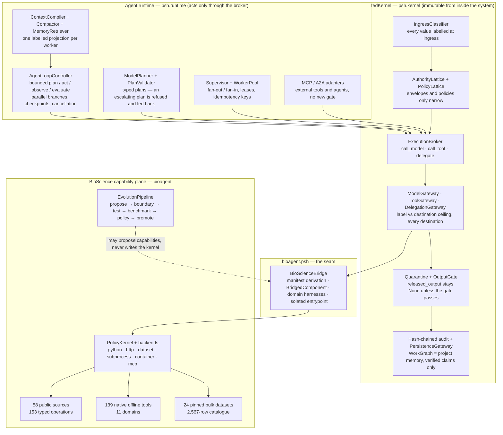
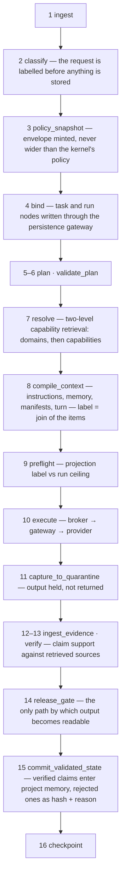
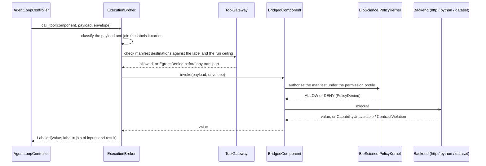

# TCMScience

[](https://github.com/psknlr/TCMScience/actions/workflows/ci.yml)

**A governed agent runtime for biomedical and traditional-medicine research.** Two
packages built for different halves of one system, and the seam between them:

* **`PSH-Harness/`** — the *Physician-Scientist Harness*: a trusted kernel that classifies
  every value at ingress, mints run envelopes that can only narrow, gates every model call,
  tool call and delegation, quarantines output until a release gate rules on it, and keeps
  a hash-chained audit trail; plus the bounded agent runtime that runs *through* it.
* **`BioScience-Harness/`** — the capability plane: 58 live-verified public biomedical
  sources (153 typed operations), 139 native offline bioinformatics and clinical tools,
  24 pinned bulk datasets, a 2,567-row capability catalogue, backends, a policy kernel and
  a gated self-evolution pipeline.
* **`bioagent.psh`** — the bridge. A BioScience capability becomes a PSH component; a call
  crosses both kernels, and the result carries the join of every label it touched.

The one rule everything obeys: **the trusted plane is immutable from inside the system.**
The runtime cannot act except through the broker; the bridge depends on PSH and PSH never
depends on it; a self-evolution proposal that targets the kernel is quarantined before a
single test is spent on it.

| | Package | Version | Tests |
| --- | --- | --- | --- |
| Trusted kernel + agent runtime | `PSH-Harness/` | **0.5.2** | 543 |
| Capability plane + bridge + toolkit + datasets | `BioScience-Harness/` | **0.2.5** | 543 unit-tier (2 skipped) + 64 connector |

---

## 中文简介

**TCMScience 是一个面向生物医学与中医药研究的“受治理”智能体运行时。** 它由两个软件包和一条连接它们的桥组成：

* **PSH-Harness（医师科学家工作台）**：可信内核 + 智能体运行时。每一个进入系统的值都会在入口处被分类打标（`PUBLIC < INTERNAL < RESEARCH_DEIDENTIFIED < SENSITIVE < PHI`），每一次运行都持有一个只能收窄、不能放宽的权限信封（`RunEnvelope`），每一次模型调用、工具调用和子代理委派都必须经过执行代理（`ExecutionBroker`）和对应的门（`ModelGateway` / `ToolGateway` / `DelegationGateway`），模型输出先进入隔离区，只有通过发布门（`OutputGate`）才会被放出，全过程写入哈希链审计日志。运行时（有界的计划‑执行‑观察‑评估循环、类型化规划器、检查点/恢复、上下文编译与压缩、受治理的项目记忆召回、监督者/工作池、租约与幂等键、MCP/A2A 适配器）**只能通过代理行动**，没有第四条路径。
* **BioScience-Harness（能力平面）**：58 个经真实联网验证的公共生物医学数据源 / 153 个类型化操作（NCBI、Ensembl、UniProt、ChEMBL、Open Targets、ClinicalTrials.gov、openFDA、Wikidata/LOTUS 天然产物等）；139 个零依赖、可离线运行的原生工具（序列分析、蛋白质、比对、格式解析、变异注释、统计推断、生存分析、群体遗传、系统发育、药动学与剂量、55 个临床计算器）；24 个已固定大小/校验和的批量数据集（NPASS、CMAUP、NP Atlas、LOTUS、HGNC、Reactome、STRING、gnomAD、NCBI Taxonomy 等）；2,567 行能力目录；策略内核、多种执行后端和带内核边界的自进化流水线。
* **`bioagent.psh` 桥**：把 BioScience 的每一个能力推导为 PSH 组件清单（目的地、数据上限、风险、许可证），一次调用同时经过两个内核。中医药相关的资源（TCMSP、HERB、SymMap、BATMAN‑TCM、ETCM）目前没有稳定的可下载文件，因此以 BIDD 的 NPASS/CMAUP 表和 Wikidata 上的 LOTUS 数据作为可验证的替代数据路径，文档中如实说明。

**快速开始（三步）：**

```bash
git clone https://github.com/psknlr/TCMScience.git && cd TCMScience
cd PSH-Harness        && pip install pytest hypothesis && PYTHONPATH=src python -m pytest -q      # 543 通过
cd ../BioScience-Harness && pip install -e ".[dev]"   && python -m pytest -q -m unit              # 543 通过
PYTHONPATH=src:../PSH-Harness/src python demo_convergence.py   # 联网演示：一个计划穿过两个内核
```

下文的英文部分给出完整的架构图、可运行的代码示例、能力清单、"已强制 / 仅声明"的诚实边界和路线图。

---

## Architecture



The same picture in plain text, for terminals:

```
          Agent runtime (psh.runtime): bounded loop, typed planner, checkpoint/resume,
          compaction, governed memory recall, supervisor + worker pool, leases,
          idempotency, MCP/A2A adapters
                                    |  every action is one of three broker calls
          PSH TrustedKernel: classification at ingress, authority + policy lattices,
          model/tool/delegation gates, quarantine + release gate, hash-chained audit,
          persistence gateway over the WorkGraph
                                    |  bioagent.psh — a call crosses both kernels
          BioScience capability plane: 2,567-row catalogue, 58 live-verified public
          sources / 153 typed operations, 139 native offline bio/clinical tools,
          24 pinned bulk datasets, policy kernel, backends, gated evolution
```

### One governed pass

`Runner.run` is the single trusted execution path. Two orderings are invariants:
classification precedes every persistence, and release precedes every trusted-memory
commit.



### A call that crosses both kernels



### Labels and destinations

Every value carries a `DataLabel`. Sensitivities form a lattice, and a destination admits
a label only up to its ceiling (`psh/labels.py`, `DEFAULT_CEILINGS`):

| Sensitivity | Meaning |
| --- | --- |
| `PUBLIC` | no sensitive content detected |
| `INTERNAL` | the user's own working material (plain text is floored here) |
| `RESEARCH_DEIDENTIFIED` | de-identified study data; the ceiling of `PUBLIC_REMOTE` |
| `SENSITIVE` | restricted or re-identifiable |
| `PHI` | protected health information; may reach local compute, local models and persistent storage |
| `SECRET` | credential material |

Destinations: `LOCAL_COMPUTE`, `LOCAL_MODEL`, `USER_OUTPUT`, `PERSISTENT`, `TRUSTED_REMOTE`,
`PUBLIC_REMOTE`. A native clinical calculator is `LOCAL_COMPUTE` at the `PHI` ceiling, so an
identifiable payload runs on it and its result carries `PHI` onward; the same payload sent
to a public connector is refused by the gate before the transport is reached.

## Repository layout

```
TCMScience/
├── PSH-Harness/                      the trusted kernel and the agent runtime (psh)
│   ├── src/psh/
│   │   ├── kernel/                   ingress, authority, egress gates, broker, quarantine,
│   │   │                             output gate, persistence, isolation, approvals, audit
│   │   ├── runtime/                  runner, loop, planner, validator, evaluator, execgraph,
│   │   │                             checkpoint, subagent, supervisor, idempotency
│   │   ├── context/                  compiler, compaction, memory retrieval
│   │   ├── capabilities/             two-level registry with progressive schema disclosure
│   │   ├── protocols/                MCP, A2A, harness and sable adapters
│   │   ├── evidence/  workgraph/     claims, support, signing; the persistent WorkGraph
│   │   ├── labels.py  policy.py  profiles.py  contracts.py  licensing.py  cli.py
│   ├── tests/                        543 tests, property tests included
│   ├── benchmarks/  docs/
├── BioScience-Harness/               the capability plane (bioagent)
│   ├── src/bioagent/
│   │   ├── providers/                catalogue rows, SKILL.md trees, 58 public sources
│   │   ├── tools/                    139 native tools in 11 domains
│   │   ├── acquisition/              24 pinned bulk datasets and the verifying downloader
│   │   ├── backends/                 python | http | dataset | subprocess | container | mcp | none
│   │   ├── runtime/                  ComponentManifest, registry, events, hot reload, AgentSpec
│   │   ├── psh/                      the PSH bridge (needs PSH-Harness; the rest does not)
│   │   ├── evolution/                propose → boundary → test → benchmark → policy → promote
│   │   ├── policy.py  config.py  status.py  cli.py
│   ├── tests/  scripts/  data/  docs/
│   ├── demo_convergence.py  demo_harness.py  demo_run.py
├── .github/workflows/ci.yml          both suites on Python 3.10 / 3.11 / 3.12; live verification manual
└── *.zip                             the uploads the reviews were written against, kept as provenance
```

## Quick start

Requirements: Python 3.10 or newer for `BioScience-Harness`, 3.11 or newer to *install*
`PSH-Harness` (CI runs both suites from source on 3.10, 3.11 and 3.12). `PSH-Harness` has no runtime dependencies; its tests need `pytest`
and `hypothesis`. `BioScience-Harness` needs `pandas` and `pyarrow`. The bridge tests
find the sibling `PSH-Harness/src` on their own when `psh` is not installed.

```bash
git clone https://github.com/psknlr/TCMScience.git && cd TCMScience

# PSH-Harness: the full suite, then byte-compile
cd PSH-Harness && pip install pytest hypothesis
PYTHONPATH=src python -m pytest -q                          # 543 pass
python -m compileall -q src

# BioScience-Harness: the unit tier (no data lake, no network), the connector tests, the release gate
cd ../BioScience-Harness && pip install -e ".[dev]"
python -m pytest -q -m unit                                 # 543 pass, 2 skipped
python -m pytest -q tests/test_public_sources.py            # 64 pass
python scripts/make_release.py --check                      # every module tracked and importable
```

### Demos

```bash
cd BioScience-Harness
PYTHONPATH=src:../PSH-Harness/src python demo_convergence.py   # live: HGNC + UniProt through both kernels,
                                                               # a PHI payload refused remotely and run locally
PYTHONPATH=src python demo_harness.py                          # the capability plane end to end
PYTHONPATH=src python scripts/verify_connectors.py --no-write  # re-verify every public source, live
```

### Command line

```bash
# PSH: work-mode profiles, harness state, audit-chain verification, cross-session briefing
cd PSH-Harness
PYTHONPATH=src python -m psh.cli profiles
PYTHONPATH=src python -m psh.cli --state-dir ./psh-state status
PYTHONPATH=src python -m psh.cli --state-dir ./psh-state verify
PYTHONPATH=src python -m psh.cli --state-dir ./psh-state brief     # once a run has bound a project

# BioScience: connectors, fetchable datasets, a size- or checksum-verified download
cd BioScience-Harness
PYTHONPATH=src python -m bioagent.cli sources
PYTHONPATH=src python -m bioagent.cli fetchable
PYTHONPATH=src python -m bioagent.cli --dest ./data fetch lotus.dataset.260413_frozen_csv_gz
```

### Python: one governed pass

```python
from pathlib import Path

from psh import get_profile
from psh.config import PSHConfig
from psh.contracts import ModelProfile
from psh.kernel import TrustedKernel
from psh.labels import Destination, Sensitivity
from psh.runtime import Runner

policy = get_profile("literature").freeze()      # RESEARCH_DEIDENTIFIED ceiling, network, R1, citations required
kernel = TrustedKernel(PSHConfig(state_dir=Path("./psh-state")).ensure_dirs(), policy=policy)

local_model = ModelProfile(id="local-stub", provider="local", destination=Destination.LOCAL_MODEL,
                           max_label=Sensitivity.PHI, usd_per_1k_input=0.0, usd_per_1k_output=0.0)
runner = Runner(kernel, model=local_model, policy=policy,
                model_invoke=lambda prompt: "TP53 is a tumour suppressor [PMID:34449189].")

result = runner.run("Summarise what TP53 does",
                    sources={"34449189": "TP53 encodes p53, a tumour suppressor."})
print(result.status, result.released_output)     # ok TP53 is a tumour suppressor [PMID:34449189].
print([s.stage for s in result.stages])           # the sixteen stages, in order
kernel.close()
```

The policy is a ceiling. `runner.run(..., risk=RiskTier.R4_KERNEL)` under this profile is
refused at `policy_snapshot`; `runner.run(..., policy=wider)` is refused too, naming the
dimension. Ask for less than the profile grants and you get it.

### Python: the bounded loop, a model planner, and project memory

```python
import json

from psh.capabilities import CapabilityRegistry
from psh.context import MemoryRetriever
from psh.contracts import Autonomy, RiskTier
from psh.policy import PolicySnapshot
from psh.runtime import AgentLoopController, ModelPlanner

policy = PolicySnapshot(profile_id="local-loop", max_data_label=Sensitivity.PHI,
                        allowed_destinations=(Destination.LOCAL_COMPUTE, Destination.LOCAL_MODEL,
                                              Destination.USER_OUTPUT, Destination.PERSISTENT),
                        autonomy=Autonomy.ACT, risk_ceiling=RiskTier.R2_CONSEQUENTIAL,
                        require_claim_support=False)
kernel = TrustedKernel(PSHConfig(state_dir=Path("./psh-state")).ensure_dirs(), policy=policy)
memory = MemoryRetriever(kernel.graph)           # verified project memory only, labelled as stored

def plan_model(prompt: str) -> str:              # a real provider goes here; it is still a broker call
    return json.dumps({"objective": "summarise", "tasks": [
        {"task_id": "t1", "objective": "summarise the evidence", "kind": "model",
         "destinations": ["LOCAL_MODEL"]}],
        "completion_criteria": [{"description": "a summary exists", "kind": "task"}]})

planner = ModelPlanner(kernel, model=local_model, model_invoke=plan_model, memory=memory)
loop = AgentLoopController(kernel, planner=planner, registry=CapabilityRegistry(),
                           model=local_model, model_invoke=lambda prompt: "a summary",
                           memory=memory)
outcome = loop.run("summarise the evidence", kernel.policy.envelope(project_id="demo"))
print(outcome.summary(), outcome.label)           # goal_satisfied after 1 iteration ... internal
print(kernel.broker.stats()["model_calls"])       # 2: the planning call and the task, nothing else
```

A plan that asks for more than the run holds — a public destination under a local-only
run, `R4_KERNEL` under `R2` — is refused by the validator and the refusal becomes the next
planning prompt. A plan that delegates when the loop has no delegate backend is corrected
the same way. Memory that the run's ceiling or the model's destination may not receive is
withheld at retrieval; the task still runs, with a quieter prompt.

### Python: native tools, directly

```python
from bioagent.tools import DOMAINS, TOOLS, tool

print(len(TOOLS), len(DOMAINS))                   # 139 11
print(tool("egfr_ckd_epi_2021").fn(creatinine_mg_dl=1.0, age_years=50, sex="female"))
# {'egfr_ml_min_1_73m2': 68.6, 'kdigo_stage': 'G2', 'equation': 'CKD-EPI 2021 creatinine'}

km = tool("kaplan_meier").fn(times=[6, 6, 6, 7, 10, 13, 16, 22, 23, 6, 9, 10],
                             status=[1, 1, 1, 1, 1, 1, 1, 1, 1, 0, 0, 0])
print(km["median_survival_time"])                 # 13.0
```

Every tool is a function of keyword arguments returning a JSON-serialisable dict, with an
example that is its smoke test, a formula named in its docstring, and input validation
that refuses implausible values with a reason.

### Python: the BioScience runtime on its own

```python
from bioagent.psh.assembly import default_runtime
from bioagent.runtime.agentspec import AgentSpec

runtime = default_runtime(catalogue=False, public_apis=False)      # native tools only: offline
spec = AgentSpec(name="demo", permission_profile="offline-analysis")
call = runtime.invoke("native.tool.bmi", spec=spec, weight_kg=70, height_cm=175)
print(call.status.value, call.value)              # SUCCEEDED {'bmi': 22.86, 'category': 'normal'}
```

Permission profiles: `offline-analysis` (no network), `biomedical-research` (every
live-verified host allowlisted, subprocess allowed), `sandbox-only`.

### Python: the bridge — BioScience capabilities inside PSH

```python
from bioagent.psh import BioScienceBridge, default_runtime

bridge = BioScienceBridge(kernel, default_runtime(catalogue=False, public_apis=False))
admitted = bridge.admit_all()                     # 139 manifests, every one LOCAL_COMPUTE at the PHI ceiling
registry = CapabilityRegistry()
print(bridge.register_into(registry))             # {'components': 139, 'harnesses': 11}

envelope = kernel.policy.envelope()
for hit in registry.resolve("estimate kidney function from creatinine", envelope, limit=3):
    print(hit.id)                                 # native.tool.egfr_ckd_epi_2021 ranks first

result = kernel.broker.call_tool(bridge.component("native.tool.bmi"),
                                 {"weight_kg": 70, "height_cm": 175}, envelope)
print(result.value, result.label.sensitivity.name)   # {'bmi': 22.86, 'category': 'normal'} INTERNAL
kernel.close()
```

Pass `default_runtime()` with its defaults to admit the public connectors and the
catalogue as well; the eleven toolkit domains and every connector domain become harnesses
in PSH's two-level registry, so a planner sees summaries to *choose* and schemas to
*call*, never 2,700 manifests at once.

## What is in the box

### Runtime and kernel (PSH)

| Mechanism | Where |
| --- | --- |
| Classification at ingress, label lattice, destination ceilings | `kernel/ingress.py`, `labels.py` |
| Authority and policy lattices: envelopes and policies only narrow, on every dimension | `kernel/authority.py`, `policy.py` |
| Broker with three calls; model, tool and delegation gates; every destination checked | `kernel/egress.py` |
| Quarantine, release gate, claim support, evidence records | `kernel/output_gate.py`, `evidence/` |
| Persistence gateway over the WorkGraph; rejected claims stored as hash + reason | `kernel/persistence.py`, `workgraph/` |
| Isolated executor: clean environment, process group, limits; sandbox seam | `kernel/isolation.py` |
| Bounded loop, typed plans, validator, layered evaluator, parallel branches | `runtime/loop.py`, `plan*.py`, `evaluator.py` |
| Model planner with validator-driven correction and delegation disclosure | `runtime/planner.py` |
| Checkpoint / resume with authority re-met on resume | `runtime/checkpoint.py` |
| Supervisor, worker pool, leases, cancellation, idempotency keys | `runtime/supervisor.py`, `subagent.py`, `idempotency.py` |
| Context compiler, compaction, memory retrieval | `context/` |
| MCP and A2A adapters that add no gate | `protocols/` |
| Eight work-mode profiles (`literature`, `clinical_research`, `data_science`, `writing`, `peer_review`, `coding`, `learning`, `administrative`) | `profiles.py` |

### Capability plane (BioScience)

| Domain | Count | Examples |
| --- | --- | --- |
| Public sources | 58 sources / 153 operations | NCBI E-utilities, Ensembl, UniProt, ChEMBL, PubChem, Open Targets, ClinicalTrials.gov, openFDA, RxNav, Reactome, STRING, gnomAD, cBioPortal, Europe PMC, Crossref, OpenAlex, Wikidata SPARQL (LOTUS natural products), GBIF |
| Native tools: sequence analysis | 18 | translation, ORFs, k-mers, primer Tm, restriction sites, IUPAC motifs, CpG islands, CRISPR guides, primer checks |
| Native tools: protein analysis | 4 | mass, pI, GRAVY, hydropathy, peptide m/z, in-silico digestion |
| Native tools: alignment | 3 | Needleman–Wunsch, Smith–Waterman, BLOSUM62 protein alignment |
| Native tools: file formats | 8 | FASTA, FASTQ, VCF, BED, GFF, SAM, PDB, OBO |
| Native tools: variants | 5 | HGVS parsing, normalisation, allele frequencies with HWE, Ts/Tv, coding-variant consequence |
| Native tools: statistics | 27 | Fisher, hypergeometric ORA with BH-FDR, Welch, Mann–Whitney, meta-analysis, chi-square, regression, ANOVA, Kruskal–Wallis, Wilcoxon, Cohen's d, post-test probability, sample size, incidence rates |
| Native tools: pharmacology | 9 | one-compartment kinetics, loading and maintenance doses, Calvert carboplatin, steroid and morphine equivalents |
| Native tools: survival analysis | 2 | Kaplan–Meier, log-rank |
| Native tools: population genetics | 3 | linkage disequilibrium, nucleotide diversity with Tajima's D, F_ST |
| Native tools: phylogenetics | 5 | JC69/K2P distances, neighbor joining, UPGMA, Newick, patristic distances |
| Native tools: clinical calculators | 55 | CKD-EPI 2021, MELD-Na, CHA₂DS₂-VASc, Wells, CURB-65, NEWS2, SOFA, Pooled Cohort Equations, acid–base interpretation, HEART, TIMI, FIB-4, APRI, HOMA-IR |
| Bulk datasets | 24 | HGNC, Reactome, STRING, gnomAD constraint, ChEMBL mapping, KEGG pathways, NPASS 2.0, CMAUP 2.0, NP Atlas, LOTUS, NCBI Taxonomy, CellMarker 3.0 |
| Catalogue | 2,567 rows | capabilities from 16 upstream biomedical agent projects, with provenance and licence class |

Correctness is pinned rather than assumed: CKD-EPI 2021 for a 50-year-old at Scr 1.0 is
68.6 / 91.7; MELD-Na for bilirubin 3, INR 2, creatinine 2, sodium 128 is 29; the Freireich
6-MP Kaplan–Meier curve runs 0.857 → 0.448 with a median of 23 weeks and a log-rank
statistic of 16.79 as R reports; neighbor joining recovers the Saitou–Nei five-taxon tree
with every path length exact; the Pooled Cohort Equations reproduce the guideline's four
worked examples.

## What is enforced, and what is stated

Enforced, with a test that drives the executing path:

* no value reaches a gateway unclassified, and a caller-supplied label is re-validated —
  a compiled projection included, whose rendered text the broker classifies and joins;
* nothing above a run's ceiling reaches a model or a tool, at the gate rather than in one
  caller's preflight, and every declared destination of a component is checked;
* no envelope is wider than the policy that minted it, on any of the lattice's dimensions,
  and a per-run policy wider than the kernel's is refused;
* every model call, tool call and delegation passes the broker, which records an event —
  the broker's counters are the proof, and a structural test refuses any route from the
  loop to the outside world;
* output is quarantined and `released_output` stays `None` unless the release gate passed;
  only verified claims enter project memory, and only verified memory is recalled;
* a `backend="subprocess"` component cannot read the kernel's environment; a timeout kills
  the process group; the sandbox contains its working directory.

Stated plainly, not enforced:

* a `backend="python"` component runs in the kernel process and is confined by nothing;
  `require_isolated_tools=True` is how a policy refuses it;
* the egress proxy governs clients that honour proxy variables; a raw socket bypasses it.
  `SandboxBackend` is the seam for the OS layer; only `NoSandbox` ships, and says so;
* BioScience's policy kernel rules on what a component *declares* (hosts, paths) and refuses
  by mechanism only licence, subprocess and unconfinable writes; genuine isolation needs a
  container runtime, and the harness reports whether one is present rather than assuming;
* the audit chain is tamper-evident, not tamper-proof; classification is a safety net, not
  certified de-identification; claim support and memory ranking are lexical.

## Roadmap status

| Milestone | State |
| --- | --- |
| Gate composition closure (one policy ceiling, every destination, lattice everywhere) | done, v0.5.1 |
| Bounded loop, typed planner, validator, evaluator, retry, termination | done |
| Context compaction, checkpoint/resume, parallel branches, schema disclosure | done |
| Supervisor, worker pool, leases, cancellation, idempotency | done |
| MCP and A2A adapters | done |
| Governed memory recall; planner told when it may delegate | done, v0.5.2 |
| PSH ⊕ BioScience bridge, kernel boundary in the evolution pipeline | done, BioScience v0.2.4 |
| 139 native tools; pinned natural-product datasets | done, BioScience v0.2.5 |
| Distributed workers across processes | open |
| A2A polling for long-running remote tasks | open |
| Semantic memory ranking (today lexical, deliberately egress-free) | open |
| Persistent admission cache for the 2,567-row catalogue | open |
| TCM databases as pinned files (HERB, BATMAN-TCM, TCMSP, HIT, TCMBank serve pages, 503 or nothing) | blocked upstream; NPASS / CMAUP / LOTUS cover the same herbs, compounds and targets |

## Development

* Every change lands through a pull request; CI runs both suites on Python 3.10, 3.11 and
  3.12 and byte-compiles both packages. Live connector verification is a manual job.
* Tests pin values against sources that can be checked by hand; a calculator that runs is
  not a calculator that is correct.
* The dependency direction is a test: `bioagent` imports `psh`, never `psh.kernel`; `psh`
  never imports `bioagent`.
* New native tools are functions in `bioagent.tools`, registered with an example, and a
  structural test refuses parameter names that the runtime's own keywords would swallow.

## Documentation

* `PSH-Harness/README.md` — the kernel, the runtime, and what is enforced versus stated.
* `PSH-Harness/docs/V5_1_GATE_COMPOSITION_CLOSURE.md` — the second review's findings,
  reproduced, fixed and tested.
* `PSH-Harness/docs/RUNTIME_SECURITY_REVIEW.md` — the adversarial review of the runtime:
  labels travel across every edge of the loop, the broker no longer trusts a projection,
  and the read side of project memory.
* `PSH-Harness/docs/ROADMAP_AGENT_RUNTIME.md` — what was built in what order, and what is
  honestly still open.
* `BioScience-Harness/README.md` — the capability plane, release by release.
* `BioScience-Harness/docs/V24_PSH_CONVERGENCE.md` — the bridge, the kernel boundary, the
  connector set and its verification record, the toolkit and the dataset tranche.
* `BioScience-Harness/docs/V23_1_CONTAINER_HONESTY.md` — container availability measured
  rather than assumed.
* `BioScience-Harness/data/connector_live_verification.csv` — every operation of every
  public source, as it answered when last verified.

## Licence and provenance

Both packages are MIT-licensed. `BioScience-Harness/NOTICE` records every upstream project
the catalogue federates, its licence, and whether it is vendorable or federated-only;
unlicensed upstream projects are never vendored. The two `*.zip` files at the repository
root are the uploads the reviews were written against, kept as provenance.
