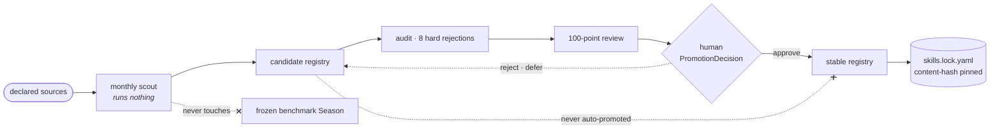

<div align="center">

# TCMScience

### The first governed autonomous research agent for Traditional Chinese Medicine

**全球首个面向中医药与生物医学科学发现的受治理自主科研智能体**

*The model may reason. It does not define the laws of the laboratory.*

<br>

**Yanlan Kang**<sup>1,†</sup> &nbsp;·&nbsp;
**Ruiqi Liu**<sup>2,†</sup> &nbsp;·&nbsp;
**Shuai Xu**<sup>3,\*</sup> &nbsp;·&nbsp;
**Xukun Zhang**<sup>4,\*</sup> &nbsp;·&nbsp;
[**William Cheng-Chung Chu**](https://www.sciopen.com/scholar/info?id=1952658822209773569)<sup>5,\*</sup>

<sub>
<sup>1</sup>Institute of Medical Philosophy &amp; Future AI (IMPF-AI) &nbsp;
<sup>2</sup>Shanghai Medical College, Fudan University &nbsp;
<sup>3</sup>Shanghai Ziranerran Traditional Chinese Medicine Foundation<br>
<sup>4</sup>Li Ka Shing Faculty of Medicine, The University of Hong Kong &nbsp;
<sup>5</sup>Fuyao University of Science and Technology<br>
<sup>†</sup>Equal contribution &nbsp; <sup>*</sup>Co-corresponding authors
</sub>

<br><br>

[**Project page**](https://psknlr.github.io/TCMScience/) &nbsp;|&nbsp;
[**Arena**](https://psknlr.github.io/TCMScience/arena/) &nbsp;|&nbsp;
**Paper** *(in preparation)* &nbsp;|&nbsp;
[**Design spec**](BioScience-Harness/docs/THIRD_PARTY_DB_CONNECTOR_SPEC.md) &nbsp;|&nbsp;
[**Citation**](#citation) &nbsp;|&nbsp;
[**简体中文**](README.zh-CN.md)

[](https://github.com/psknlr/TCMScience/actions/workflows/ci.yml)
[](https://opensource.org/licenses/MIT)
[](https://www.python.org/downloads/)


</div>

<p align="center">
  
</p>

## Abstract

Chinese medicine rests on evidence of very different kinds: a *Shanghan Lun* passage, a pharmacopoeia entry, a docking score, a cell assay, a randomized trial. A language-model agent that treats them all as "evidence text" will, sooner or later, present a classical record as a clinical finding or a network prediction as a mechanism. **TCMScience** makes that failure impossible to express rather than merely discouraged. The model plans and reasons; a separate **trusted kernel** decides what it may run, labels every datum at entry, and releases a scientific claim only when the evidence behind it *licenses* that kind of claim. Every dataset the agent reads is a **content-hashed snapshot** recorded in a hash-chained ledger, so each result names the exact data it came from. Applied to the classical formula 葛根芩连汤, the system reproduces the standard network-pharmacology result and then shows it to be an artefact of which proteins had been assayed. What survives is a cytochrome P450 inhibition signal that bears on herb–drug interactions rather than on efficacy.

## Highlights

| | Contribution | What it prevents |
|:-:|---|---|
| **1** | **Evidence kinds are types, not grades.** The study design is stored; the tier is derived from it. | A cell assay and an animal study collapsing into one "preclinical" label, and a classical record being read as clinical evidence. |
| **2** | **A computational prediction cannot become a fact, by construction.** Predictive designs license a *mechanism hypothesis* and nothing stronger, enforced by the kernel's claim–support table. | Network-pharmacology output reported as "the mechanism of action". |
| **3** | **Data enter as audited snapshots.** Parse → normalize → quality gate → content hash → ledger, each source under a card stating its licence and access terms. | Results that cannot say which release of which database produced them. |
| **4** | **Skills, sources and benchmarks are versioned independently**, and a monthly update can discover skills but never promote them. | This month's score being incomparable with last month's, or an unreviewed skill going live. |

## Key results: a case study on 葛根芩连汤

The formula (葛根, 黄芩, 黄连, 甘草 as recorded in the *Shanghan Lun*) was analysed end to end with the shipped network-pharmacology skill on public data: NPASS, CMAUP and LOTUS for composition; curated potency measurements and PubChem BioAssay for activity; Reactome and STRING for biology; Open Targets for the indication. The marker compounds of all four herbs (puerarin, baicalin, berberine, glycyrrhizic acid) were recovered in all three composition sources.

**1 · The usual enrichment result is explained by assay coverage.** 1,792 constituents; 391 human proteins with a measured potency, 237 of them at ≤ 10 µM.

| Background for pathway enrichment | Proteins | Pathways tested | Significant (BH + degree-matched null) |
|---|---:|---:|---:|
| Whole human Reactome annotation (the common practice) | 12,155 | 1,684 | **66** |
| Proteins that were actually assayed (default) | 391 | 959 | **0** |

All 12 carbonic-anhydrase-pathway proteins had been assayed, and 11 were hits. The pathways looked enriched because they had been tested, not because they had been hit. The assayed background has little power in turn: 61 % of assayed proteins are recorded as hits, because databases rarely record inactive results.

**2 · With inactive results included, one signal remains: CYP inhibition.** PubChem BioAssay contributes 143,702 results (10,710 active, 132,992 inactive). On the 116 proteins tested against ≥ 20 constituents (12,579 tests, 8.6 % active), the pathways that pass are cytochrome P450 pathways (q = 0.023–0.026 with 10,000 permutations), as they are at ≥ 50 constituents (q = 0.017). They are driven by **CYP1A2** (136 of 205 constituents active) and **CYP2C9** (78 of 206) in uniform Tox21 panels. At the loosest threshold (≥ 10) a carbonic-anhydrase pathway passes instead, carried by small literature sets chosen for their actives. This is a **herb–drug interaction signal**, not evidence for a mechanism of action.

**3 · The disease overlap depends on how the disease is defined.** Measured targets against type 2 diabetes genes (Open Targets 26.06):

| Disease gene set | Overlap | Fold | p |
|---|---:|---:|---:|
| Human genetic association, score ≥ 0.5 (default) | 9 | 0.95 | 0.61 |
| Literature co-mention, score ≥ 0.5 | 58 | 5.34 | 7.7 × 10⁻²⁷ |

The literature-defined enrichment is circular, because compound–target data and text mining study the same well-known proteins. The pipeline therefore defaults to genetic evidence and warns whenever literature is chosen. Full methods, sensitivity analyses and limitations are in the [design spec](BioScience-Harness/docs/THIRD_PARTY_DB_CONNECTOR_SPEC.md).

## Evidence governance

<p align="center">
  
</p>

The figure is drawn from `psh.workflow.compiler._SUPPORTS`, the table the kernel enforces ([generator](docs/assets/make_figures.py)). The same rule is applied three times:
1. **At compile time.** A skill whose steps cannot license its declared claim kind is rejected (`EVIDENCE103`).
2. **At the claim.** Each cited item must license the claim kind, weakest link first (`CLM005`).
3. **At release.** A claim leaves only if every edge on its path exists in a verified snapshot. The strongest kind that path supports is recorded, together with the reason the claim stops there.

An overclaim is *constructible* and refused with its own error code, because a system that cannot represent an overclaim cannot measure one either.

## Quick start

No install, no configuration, no API key, no network:

```bash
cd BioScience-Harness && python examples/run_skills.py
# … 5/5 artifacts passed the publication gate
```

Install as libraries (Python ≥ 3.11). `[test]` is not optional: without `hypothesis`, eleven PSH test modules are silently skipped.

```bash
pip install -e "PSH-Harness[test]"          # trusted kernel
pip install -e "BioScience-Harness[dev]"    # capability plane + governance layer
```

```python
from bioagent.skills.p0 import assess_tcm_safety
from bioagent.contracts import validate_artifact

artifact = assess_tcm_safety("甘草", co_administered=["甘遂"])   # 十八反
verdict = validate_artifact(artifact)
print(artifact.composite_version_string)   # runtime · skill · sources · benchmark
print(verdict.publishable, verdict.codes)
```

<details>
<summary><b>Command line, the network-pharmacology pipeline, and tests</b></summary>

```bash
# list and run skills
python -m bioagent.cli skills --dir BioScience-Harness/skills/tcm
python -m bioagent.cli skill normalize-tcm-entities --arg names=姜,白芍 --dir BioScience-Harness/skills/tcm

# the 葛根芩连汤 case study (raw files from the providers' download pages)
cd BioScience-Harness
python scripts/build_source_snapshots.py gold --network --raw RAW --out SNAP --ledger SNAP/audit/snapshots.jsonl
python scripts/fetch_opentargets.py MONDO_0005148 --raw RAW
python scripts/fetch_pubchem.py --composition SNAP/composition.json --raw RAW
python scripts/run_network_pharmacology.py --snapshots SNAP --ledger SNAP/audit/snapshots.jsonl --out RUN
python scripts/run_network_pharmacology.py ... --hits screening          # PubChem, inactives included

# tests: PSH 961 · BioScience 949
cd PSH-Harness        && PYTHONPATH=src python -m pytest -q
cd BioScience-Harness && PYTHONPATH=src:../PSH-Harness/src python -m pytest -q -m unit
```

More in [INSTALL.md](INSTALL.md) and [USAGE.md](USAGE.md).
</details>

## Architecture

An LLM should not be its own planner, executor, security policy, evidence judge and publication authority all at once. TCMScience therefore separates three planes (figure above):

- **Trusted kernel ([PSH-Harness](PSH-Harness)).** Labels data at entry, intersects every request with a policy lattice, compiles plans into typed and bounded programs, routes every model, tool and delegation call through one gateway, and quarantines output before release. Its audit is hash-chained.
- **Capability plane ([BioScience-Harness](BioScience-Harness)).** 58 verified public sources with 153 typed operations, 147 native tools in 12 domains, a typed TCM layer (herbs, processing, formulas with 君臣佐使 roles, syndromes, classical passages, 十八反), and the source-snapshot layer.
- **Governance layer.** Skill manifests compiled into kernel programs, data contracts with validators, a registry with a content-hashed lockfile, and the benchmark harness.

### Skills

| Skill | What it refuses to do |
|---|---|
| `normalize-tcm-entities` | Choose for you when a name is ambiguous: 「姜」 may be 生姜 or 干姜, which are different drugs. |
| `retrieve-tcm-evidence` | Pass judgement: an empty result is not "no effect", and unassessed bias stays `NOT_ASSESSED`. |
| `analyze-tcm-network-pharmacology` | Conflate prediction with measurement: predicted and measured targets are separate keys, and it claims a mechanism *hypothesis* only. |
| `assess-tcm-safety` | Answer "safe": no record is not safety, and 十八反 is checked as a property of the pair. |
| `tcm.network-pharmacology` | Report enrichment without its controls: it runs the case study above on ledger-verified snapshots and writes full provenance. |

### Data sources

Every source has a card stating its licence and access path. Web access is off unless a person has approved it, and a skill can narrow its sources but never widen them.

| Source | Provides | Licence |
|---|---|---|
| NPASS 2.0 · CMAUP 2.0 | composition, measured activity | free for academic use |
| LOTUS (frozen export) | composition | CC BY 4.0 |
| BindingDB | measured binding | CC BY 4.0 |
| PubChem BioAssay | screening results, inactives included | NCBI data policy |
| STRING v12 | protein associations | CC BY 4.0 |
| Reactome | pathway membership | CC0 |
| Open Targets 26.06 | target–disease associations | CC0 |

## TCMScience Arena

A read-only public evaluation site ([live](https://psknlr.github.io/TCMScience/arena/), [source](arena/web)). It **renders results and never computes a score**, so changing the site cannot change a result. It covers six tracks (entity, evidence, network pharmacology, safety, trial audit, end-to-end) scored on eight dimensions that are always shown decomposed. A run stopped by a hard gate stays visible on the experimental board. Benchmark cases and gold answers are not distributed with the code, and `scripts/check_leakage.py` verifies that none has leaked.

<details>
<summary><b>Monthly skill discovery: it can discover, it cannot promote</b></summary>



Architecture decisions: [0001](docs/adr/0001-three-registry-separation.md) registry separation ·
[0002](docs/adr/0002-independent-version-axes.md) independent version axes ·
[0003](docs/adr/0003-skill-yaml-compilation-contract.md) `skill.yaml` as the compilation contract ·
[0004](docs/adr/0004-arena-read-only-static-first.md) a read-only Arena.
</details>

<details>
<summary><b>Repository layout</b></summary>

```text
TCMScience/
├── PSH-Harness/                  trusted kernel: authority · egress · quarantine · release · workflow IR
├── BioScience-Harness/
│   ├── src/bioagent/
│   │   ├── sources/              source cards · parsers · snapshots · ledger · release check
│   │   ├── analysis/             network pharmacology on verified snapshots
│   │   ├── contracts/            evidence · claim · artifact · quality validators
│   │   ├── skills/               manifest loader · compiler · four P0 skills
│   │   ├── updates/ benchmarks/  registry, scout, benchmark harness
│   │   └── tcm/                  typed TCM knowledge + seed corpus
│   ├── skills/tcm/               skill.yaml + SKILL.md
│   └── registry/                 lockfiles and release records
├── arena/web/                    the read-only evaluation site
├── site/                         this project's page
└── docs/                         ADRs, figures and their generator
```
</details>

## What we do not claim

TCMScience does **not** claim general immunity to prompt injection, certification-grade de-identification, or a tamper-proof execution environment:
- Components running in-process are not isolated, and the egress proxy governs only clients that honour it.
- The bundled sandbox backend is a no-op, and says so.
- The audit chain is tamper-*evident*, not tamper-proof.

Real isolation needs a container runtime or an OS sandbox. Every analytic result above comes with its stated limitations, and a result that is not significant is not evidence of irrelevance.

## Citation

```bibtex
@software{kang2026tcmscience,
  title  = {TCMScience: A Governed Autonomous Research Agent for Traditional Chinese Medicine},
  author = {Kang, Yanlan and Liu, Ruiqi and Xu, Shuai and Zhang, Xukun and Chu, William Cheng-Chung},
  year   = {2026},
  url    = {https://github.com/psknlr/TCMScience},
  note   = {Open-source research software}
}
```

<div align="center">
<sub>

Released under the [MIT License](https://opensource.org/licenses/MIT). Upstream data keep their own licences (see the source cards).<br>
**从经典知识到可验证证据。** *From classical knowledge to testable evidence.*

</sub>
</div>
