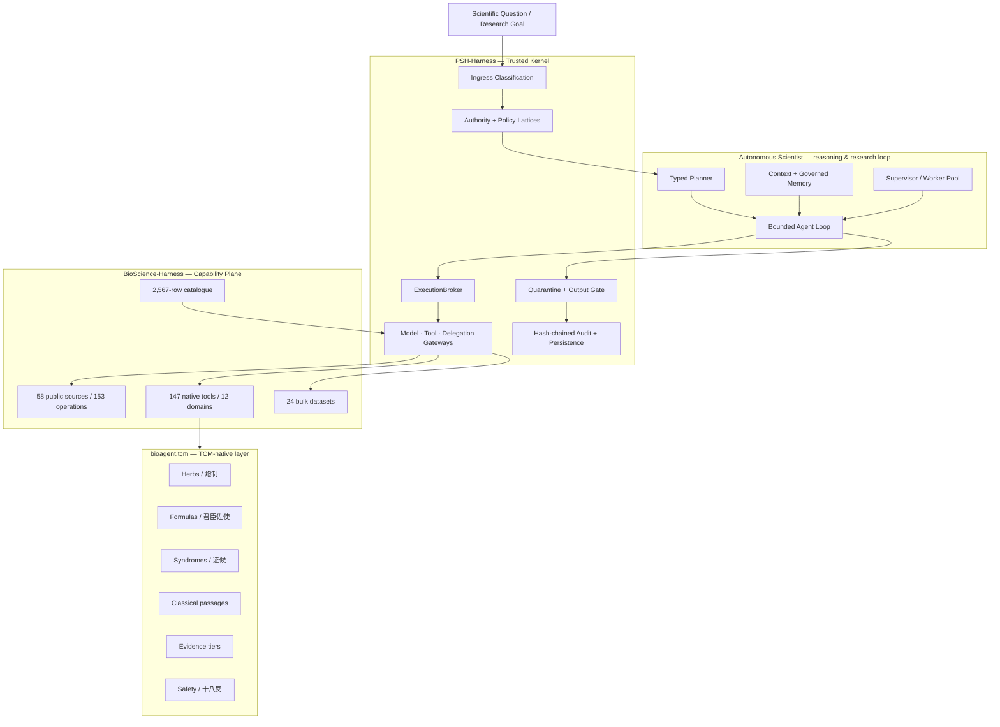

<div align="center">

# TCMScience: An Autonomous Scientist for Traditional Chinese Medicine

### A governed, evidence-grounded and reproducible AI scientist for TCM & biomedical research

**首个面向中医药与生物医学科学发现的受治理自主科研智能体**

[](https://github.com/psknlr/TCMScience/actions/workflows/ci.yml)
[](https://opensource.org/licenses/MIT)
[](https://www.python.org/downloads/)


## Authors

**Yanlan Kang¹† · Ruiqi Liu²† · Shuai Xu³* · Xukun Zhang⁴* · [William Cheng-Chung Chu](https://www.sciopen.com/scholar/info?id=1952658822209773569)⁵***

### Affiliations

¹ Institute of Medical Philosophy & Future AI (IMPF-AI)
² Shanghai Medical College, Fudan University
³ Shanghai Ziranerran Traditional Chinese Medicine Foundation
⁴ Li Ka Shing Faculty of Medicine, The University of Hong Kong
⁵ Fuyao University of Science and Technology

† **These authors contributed equally to this work.**
* **Co-corresponding authors:** Shuai Xu, Xukun Zhang, and William Cheng-Chung Chu


</div>

---

## Overview

**TCMScience** is an open research framework for building an **autonomous scientist for Traditional Chinese Medicine (TCM)**: an AI research system that can plan scientific tasks, retrieve and grade evidence, call biomedical and TCM tools, execute analyses, inspect intermediate results, generate testable hypotheses, verify claims, and release only policy-compliant outputs.

The central design choice is simple:

> **The language model may reason, but it does not define the laws of the laboratory.**

In high-stakes biomedical research, an LLM should not be its own planner, executor, security policy, evidence judge and release authority at the same time. TCMScience therefore separates the **reasoning plane** from the **trusted execution plane**. Model-generated plans are typed, bounded and validated. Data are labelled at ingress. Tool/model/delegation calls must cross explicit gateways. Outputs are quarantined before release. Scientific claims are checked against evidence scope and provenance before they can enter trusted project memory.

TCMScience is inspired by the emerging vision of automated scientific discovery [1] and general-purpose biomedical agents [2], but focuses on a problem that requires additional structure: **TCM knowledge is heterogeneous across classical texts, materia medica, formulas, syndrome theory, modern molecular evidence and clinical studies, and these evidence types must not be silently collapsed into one another.**

### 中文简介

**TCMScience** 是首个面向“**自动中医药科学家（Autonomous TCM Scientist）**”智能体Harness能够围绕一个中医药科学问题，自主完成**任务规划 → 文献/数据库检索 → 证据分级 → 工具调用 → 数据分析 → 假说生成 → 反证与核验 → 结果发布 → 可追溯科研记忆**的闭环。此外模型及智能体基于**规则受控科研环境**工作以保证安全可信。

因此，TCMScience 将：

* **智能体的推理能力**与**系统的执行权限**解耦；
* **经典记载、传统应用、临床前机制、病例、观察性研究、RCT、系统评价**分层建模；
* 将药材、炮制品、方剂、君臣佐使、证候、经典条文、安全禁忌等作为**原生中医药对象**，而不是普通文本字符串；
* 将模型输出默认视为**待验证科研对象**，而不是天然可信的结论；
* 对进入系统的数据、离开系统的输出以及跨模型/工具的调用建立**标签、策略、审计与发布门**。

TCMScience 的目标不是“让 AI 代替科学家做判断”，而是构建一个能够进行**可验证、可审计、可复现科学工作的自主研究系统**。

---

## Why TCMScience?

### From a chatbot to a scientist

A scientific agent must do more than answer questions.

| Conversational agent               | TCMScience autonomous scientist                                 |
| ---------------------------------- | --------------------------------------------------------------- |
| Generates an answer                | Builds and executes a research plan                             |
| Retrieves text                     | Retrieves evidence with provenance and scope                    |
| Calls tools opportunistically      | Calls tools through typed, policy-gated capabilities            |
| Mixes evidence in free text        | Separates evidence tiers and claim types                        |
| Produces a final response directly | Quarantines, verifies and releases output                       |
| Treats TCM as unstructured text    | Models herbs, formulas, syndromes, classics and safety natively |
| Keeps conversational memory        | Commits only governed, verified project memory                  |
| Can silently overclaim             | Must expose unsupported/extrapolated claims                     |

### Why governance matters

An autonomous researcher needs a laboratory whose rules cannot be rewritten by the researcher itself.

TCMScience therefore implements a **governed harness** around the scientific agent:

* **Prompt-injection-resistant control plane** — model-authored text does not rewrite kernel policy.
* **Monotonic authority** — a run envelope can be narrowed but cannot be widened beyond the policy that minted it.
* **Data labels at ingress** — data sensitivity travels with the value through the research workflow.
* **Quarantine before release** — generated output is not trusted merely because a model produced it.
* **Evidence-aware memory** — verified claims can enter project memory; rejected claims are not silently promoted into future context.
* **Tamper-evident audit** — execution events are recorded in a hash-chained audit trail.
* **Honest isolation reporting** — the system distinguishes process-level controls from OS-level sandboxing instead of claiming isolation that is not present.

> TCMScience does **not** claim universal immunity to prompt injection, certified de-identification, or a tamper-proof execution environment.

---

## System at a glance

| Layer                              | Capability                                                                                                                          |
| ---------------------------------- | ----------------------------------------------------------------------------------------------------------------------------------- |
| **Trusted kernel**                 | PSH-Harness `0.5.3`                                                                                                                 |
| **Biomedical capability plane**    | BioScience-Harness `0.2.6`                                                                                                          |
| **Public biomedical sources**      | **58** sources                                                                                                                      |
| **Typed public operations**        | **153** operations                                                                                                                  |
| **Native offline tools**           | **147** tools across **12** domains                                                                                                 |
| **Pinned/fetchable bulk datasets** | **24**                                                                                                                              |
| **Unified capability catalogue**   | **2,567** rows                                                                                                                      |
| **TCM-native tools**               | **8**                                                                                                                               |
| **TCM seed knowledge**             | 23 herbs · 5 processed herbs · 6 formulas · 8 syndromes · 9 classical passages · 2 study records · 14 relations · 14 safety records |

---

## Architecture

### Scientific workflow compiler (initial implementation)

`psh.workflow` now compiles versioned scientific task contracts into the existing
governed runtime. It checks declared evidence/claim scope, propagates sensitivity
through dependencies, checks effects and retry semantics, and reports which tasks
an amended workflow invalidates. Propagated sensitivity is preserved at runtime
and in plan checkpoints.

This is the first implementation increment, not the complete VNext architecture.
See the [compiler guide, runnable example and remaining roadmap](PSH-Harness/docs/SCIENTIFIC_WORKFLOW.md).

The next increment, `psh.scientist`, records hypotheses, preregistered protocols and
observations in WorkGraph. Changes to a registered analysis require explicit
deviation records; source labels and lineage are retained, and candidate findings
are not automatically promoted to verified memory. See [scientific records and
protocol deviations](PSH-Harness/docs/SCIENTIFIC_RECORDS.md).

For interrupted runs, an optional [durable checkpoint journal](PSH-Harness/docs/DURABLE_CHECKPOINT_JOURNAL.md)
preserves governed snapshots with integrity checks. Atomic operation admission and
conservative handling of non-idempotent failures prevent unsafe blind retries.



---

## Evidence-aware TCM reasoning

| Rank | Evidence tier       | 中文          | Claim type      |
| ---: | ------------------- | ----------- | --------------- |
|    1 | `CLASSICAL_TEXT`    | 经典文献记载      | attribution     |
|    2 | `EXPERT_EXPERIENCE` | 名医经验 / 专家共识 | traditional use |
|    3 | `PRECLINICAL`       | 临床前研究       | mechanism       |
|    4 | `CASE_REPORT`       | 病例报告 / 病例系列 | safety signal   |
|    5 | `OBSERVATIONAL`     | 观察性研究       | association     |
|    6 | `RANDOMIZED_TRIAL`  | 随机对照试验      | efficacy        |
|    7 | `SYSTEMATIC_REVIEW` | 系统评价 / 荟萃分析 | recommendation  |

A classical text can be the primary provenance for a **classical attribution**, while remaining insufficient evidence for a modern **clinical efficacy** claim.

---

## Citation

```bibtex
@software{kang2026tcmscience,
  title        = {TCMScience: An Autonomous Scientist for Traditional Chinese Medicine},
  author       = {Kang, Yanlan and Liu, Ruiqi and Xu, Shuai and Zhang, Xukun and Chu, William Cheng-Chung},
  year         = {2026},
  url          = {https://github.com/psknlr/TCMScience},
  note         = {Open-source research software}
}
```

<div align="center">

### TCMScience

**From classical knowledge to testable evidence. From AI agents to an autonomous TCM scientist.**

**从经典知识到可验证证据，从科研智能体到自动中医药科学家。**

</div>
