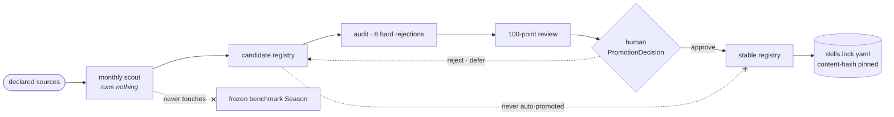

<div align="center">

# TCMScience

### A governed scientific runtime for autonomous research in Traditional Chinese Medicine

**面向中医药与生物医学的受治理自主科研运行时**

*The model may reason. It does not define the laws of the laboratory.*

<br>

**Yanlan Kang**<sup>1,†</sup> &nbsp;·&nbsp;
**Ruiqi Liu**<sup>2,†</sup> &nbsp;·&nbsp;
**Shuai Xu**<sup>3,\*</sup> &nbsp;·&nbsp;
**Xukun Zhang**<sup>4,\*</sup> &nbsp;·&nbsp;
[**William Cheng-Chung Chu**](https://www.sciopen.com/scholar/info?id=1952658822209773569)<sup>5,\*</sup>

<sub>
<sup>1</sup>Institute of Medical Philosophy &amp; Future AI (IMPF-AI) &nbsp;
<sup>2</sup>Shanghai Medical College, Fudan University &nbsp;
<sup>3</sup>Shanghai Ziranerran Traditional Chinese Medicine Foundation<br>
<sup>4</sup>Li Ka Shing Faculty of Medicine, The University of Hong Kong &nbsp;
<sup>5</sup>Fuyao University of Science and Technology<br>
<sup>†</sup>Equal contribution &nbsp; <sup>*</sup>Co-corresponding authors
</sub>

<br><br>

[**Project page**](https://psknlr.github.io/TCMScience/) &nbsp;|&nbsp;
[**Arena**](https://psknlr.github.io/TCMScience/arena/) &nbsp;|&nbsp;
**Paper** *(in preparation)* &nbsp;|&nbsp;
[**Design spec**](BioScience-Harness/docs/THIRD_PARTY_DB_CONNECTOR_SPEC.md) &nbsp;|&nbsp;
[**Citation**](#citation) &nbsp;|&nbsp;
[**简体中文**](README.zh-CN.md)

[](https://github.com/psknlr/TCMScience/actions/workflows/ci.yml)
[](https://opensource.org/licenses/MIT)
[](https://www.python.org/downloads/)


</div>

<p align="center">
  
</p>

## Abstract

Chinese medicine rests on evidence of very different kinds: a *Shanghan Lun* passage, a pharmacopoeia entry, a docking score, a cell assay, a randomized trial. A language-model agent that treats them all as "evidence text" will, sooner or later, present a classical record as a clinical finding or a network prediction as a mechanism. **TCMScience** makes that failure impossible to express rather than merely discouraged. The model plans and reasons; a separate **trusted kernel** decides what it may run, labels every datum at entry, and releases a scientific claim only when the evidence behind it *licenses* that kind of claim. Every dataset the agent reads is a **content-hashed snapshot** recorded in a hash-chained ledger, so each result names the exact data it came from. Applied to the classical formula 葛根芩连汤, the system reproduces the standard network-pharmacology result and then shows it to be an artefact of which proteins had been assayed. What survives is a cytochrome P450 inhibition signal that bears on herb–drug interactions rather than on efficacy. An architecture is an advantage only if it changes what gets released, so that is measured too: the same 111 erroneous outputs go through every configuration of the real gates, and the full stack releases 9 % of them, against 100 % with no governance and 13 % with the kernel alone, while refusing none of the correct ones. Which analysis to run next, and when to stop, is decided the same way the release is: the model proposes explanations and what each predicts, and the kernel decides what was learned.

## What TCMScience is, and is not

TCMScience is not primarily a tool-rich biomedical agent. It is a **governed scientific runtime** in which computational actions, evidence, claims and publication authority are each typed and controlled independently of the model that proposes them, with native support for Traditional Chinese Medicine.

Agent systems for biomedical research put their weight on different layers. TCMScience puts its weight on the last two below, and is meant to connect to the others rather than compete with them on breadth.

| Layer | The question it answers | Where published systems put their weight | TCMScience |
|---|---|---|---|
| Tools | What can an agent call? | [ToolUniverse](https://github.com/mims-harvard/ToolUniverse): more than 1,000 models, datasets, APIs and packages, and 68 prebuilt research workflows (README, Oct 2026) | 58 public sources, 153 typed operations and 147 native tools, each behind a source card |
| Actions | How does an agent compose them into research? | [Biomni](https://doi.org/10.1126/science.adz4351) (*Science*, 2026): 150 tools, 59 databases and 105 software packages drawn from 25 biomedical subfields; tool retrieval, planning, code execution | plans compiled into typed, bounded programs before anything runs |
| Cognition | How does it explore and decide? | [DeepEvidence](https://doi.org/10.1038/s42256-026-01266-0) (*Nat. Mach. Intell.*, 2026): breadth- and depth-first research over an evidence graph · [BioMedAgent](https://doi.org/10.1038/s41551-026-01634-6) (*Nat. Biomed. Eng.*, 2026): 77 % of 327 data-analysis tasks · [BioDiscoveryAgent](https://proceedings.iclr.cc/paper_files/paper/2025/hash/4252dc94531833029000f85dc5fac792-Abstract-Conference.html) (ICLR 2025): closed-loop design of genetic perturbation experiments | an inquiry engine over predictions sealed in advance ([below](#deciding-what-to-find-out-next)); new, and checked only on planted worlds |
| **Epistemics** | What may this evidence support? | tracking, attribution and validation of the evidence gathered | **study designs are types, and one table the kernel enforces says which claim kinds each design licenses: at compile time, at the claim and at release** |
| **Governance** | What may run, persist and be released, on whose authority? | left to the deployment: Biomni's README asks for an isolated environment, because its agent runs generated code with full system privileges | **a trusted kernel: authority that can only narrow, labels at entry, one gateway for every call, quarantine, a release gate, a hash-chained audit** |

**Where others are stronger.** Breadth of tools, databases and software (ToolUniverse, Biomni); wet-laboratory protocols and multi-omics workflows; closed-loop experimental design run against real screens (BioDiscoveryAgent); and, above all, validation on public task benchmarks under peer review (Biomni, BioMedAgent, DeepEvidence). TCMScience's six-track Arena is an evaluation design with demonstration runs, not yet a completed validation.

**What is measured instead, for now.** Whether the governance changes what an agent releases ([governance ablation](#is-the-governance-worth-it)), and whether the inquiry finds the true explanation where the answer is known ([planted worlds](#deciding-what-to-find-out-next)). [BiomniBench](https://doi.org/10.64898/2026.05.12.724604) reports that the agent harness can shift scores by more than a model generation does, which is the reason to study the harness itself. The comparison this architecture still owes is the same model, tools and tasks, with and without it, on a public task benchmark.

## Highlights

| | Contribution | What it prevents |
|:-:|---|---|
| **1** | **Evidence kinds are types, not grades.** The study design is stored; the tier is derived from it. | A cell assay and an animal study collapsing into one "preclinical" label, and a classical record being read as clinical evidence. |
| **2** | **A computational prediction cannot become a fact, by construction.** Predictive designs license a *mechanism hypothesis* and nothing stronger, enforced by the kernel's claim–support table. | Network-pharmacology output reported as "the mechanism of action". |
| **3** | **Data enter as audited snapshots.** Parse → normalize → quality gate → content hash → ledger, each source under a card stating its licence and access terms. | Results that cannot say which release of which database produced them. |
| **4** | **Skills, sources and benchmarks are versioned independently**, and a monthly update can discover skills but never promote them. | This month's score being incomparable with last month's, or an unreviewed skill going live. |
| **5** | **Belief moves only by predictions sealed in advance.** The model proposes rival explanations and what each predicts; the kernel picks the next analysis by information gain, updates belief, and stops only after severe tests and replication. | Confirmatory analyses run until the story is good; a docking run moving belief in clinical efficacy; a posterior quoted as a licence. |
| **6** | **The governance is measured, not asserted.** 111 erroneous outputs through every configuration of the real gates: all released with no governance, 9 % with the full stack, no correct output refused. | An architecture judged by its diagrams. |

## Is the governance worth it?

An architecture is only an advantage if the same outputs come out of it with fewer scientific errors. The governance ablation ([method and full results](docs/governance-ablation.md)) takes ten outputs a reviewer would release and injects one known error at a time: a population the study did not enrol, a docking score cited for efficacy, 白附子 for 附子, a dose read ten times too high, a tampered or invented citation, a plan clause hiding a claim of cure. That gives 111 mutants in 21 classes. They run through the runtime's own gates with each part switched on or off.

| Configuration | Errors released (95 % CI) | Correct outputs refused |
|---|---:|---:|
| no governance | 111/111 · 100 % (97–100 %) | 0/10 |
| domain layer only | 69/111 · 62 % (53–71 %) | 0/10 |
| kernel only | 14/111 · 13 % (8–20 %) | 0/10 |
| **full stack** | **10/111 · 9 % (5–16 %)** | **0/10** |

The layers are not redundant. Switching off one gate releases more errors:

| Gate switched off | Further errors released | Which |
|---|---:|---|
| output gate | 38 | inverted directions, drift in the text from the structured claim, the ×10 dose, invented citations |
| ingest signature check | 10 | nine tampered records and one misattributed passage |
| licensing | 3 | an over-certain mechanism claim and two misattributions in structured claims |
| claim contract | 3 | near-name herbs written in the text, and an over-certain hypothesis |
| release check | 1 | a borrowed direction |

On the code before this release, the full stack released 19/111. This release closes three gaps the benchmark found. The ten errors still released are listed with their causes, among them citations of 伤寒论 passages that no gate can look up yet.

These numbers are for regression testing, with a stated construction; they are not field error rates. The authors of the gates also wrote the cases and the operators. CI refuses any regression against these numbers.

## Deciding what to find out next

The kernel decides what an agent may run and what a released claim may say. Between the two sits the decision an autonomous scientist makes most often: which analysis to run next, how far its result moves belief, and when enough is known. `psh.scientist.inquiry` makes these computations over commitments made in advance ([docs](docs/inquiry.md)):

- The model proposes rival explanations, an explicit catch-all, and what each explanation predicts every analysis will show. The predictions are sealed before anything runs.
- The kernel picks the analysis with the most expected information per unit of cost, and updates belief by the sealed predictions alone. It holds fixed any explanation whose claim kind the analysis's design cannot license: a docking run cannot move belief in efficacy.
- The leader is accepted only after a replicated severe test against every live rival. The conclusion is capped by the licensing table, not by the posterior. The trail replays to the same belief.

We applied it to a pathway signal in 葛根芩连汤: is the signal the formula's activity, which proteins were assayed, or promiscuous chemistry? We tested it on three planted worlds whose answer is known:

| World | True explanation | Verdict | Mechanism claims released | Network-pharmacology runs |
|---|---|---|---:|---:|
| selective | the formula's activity | accepted; a tentative mechanism hypothesis | 1 | 45 of 67 |
| coverage | which proteins were assayed | accepted; a finding about the analysis | 0 | 14 of 67 |
| promiscuous | promiscuous chemistry | accepted; a finding about the analysis | 0 | 45 of 67 |

Before anything runs, the usual analysis (enrichment against the whole Reactome annotation) is worth 0.06 bits, because every explanation predicts it comes out enriched. The assayed background is worth 0.43 bits.

Planted worlds show the mechanics. They are not evidence that the engine decides real questions well.

## Key results: a case study on 葛根芩连汤

The formula (葛根, 黄芩, 黄连, 甘草 as recorded in the *Shanghan Lun*) was analysed end to end with the shipped network-pharmacology skill on public data: NPASS, CMAUP and LOTUS for composition; curated potency measurements and PubChem BioAssay for activity; Reactome and STRING for biology; Open Targets for the indication. The marker compounds of all four herbs (puerarin, baicalin, berberine, glycyrrhizic acid) were recovered in all three composition sources.

**1 · The usual enrichment result is explained by assay coverage.** 1,792 constituents; 391 human proteins with a measured potency, 237 of them at ≤ 10 µM.

| Background for pathway enrichment | Proteins | Pathways tested | Significant (BH + degree-matched null) |
|---|---:|---:|---:|
| Whole human Reactome annotation (the common practice) | 12,155 | 1,684 | **66** |
| Proteins that were actually assayed (default) | 391 | 959 | **0** |

All 12 carbonic-anhydrase-pathway proteins had been assayed, and 11 were hits. The pathways looked enriched because they had been tested, not because they had been hit. The assayed background has little power in turn: 61 % of assayed proteins are recorded as hits, because databases rarely record inactive results.

**2 · With inactive results included, the signal is drug-metabolising enzymes.** PubChem BioAssay contributes 143,679 results on 1,029 human proteins (10,696 active, 132,983 inactive). On the 472 proteins tested against ≥ 20 constituents (51,304 tests, 6.5 % active), nine pathways pass (10,000 permutations, q = 0.008–0.026). Six are drug-metabolism pathways carried by cytochrome P450s (xenobiotics, EET/DHET and 16-20-HETE synthesis, maresin-like SPM biosynthesis, aspirin ADME, CYP2E1 reactions), five of which pass at every threshold (≥ 10, 20 and 50 constituents). They are driven by uniform Tox21 and qHTS panels: **CYP1A2** (136 of 205 constituents active), **CYP2C19** (91/204), **CYP2C9** (78/206), **CYP2D6** (75/204) and **CYP3A4** (70/224). This is a **herb–drug interaction signal**, not evidence for a mechanism of action. The nuclear-receptor transcription pathway also passes (22 receptors, 16.9 % of tests active): ESR1 activity is mostly agonist-mode (flavonoids and isoflavones, as expected of phytoestrogens), while the AR, PPARG and THRB actives come mostly from antagonist-mode reporter assays, which cytotoxicity and luciferase inhibition confound. Carbonic-anhydrase pathways pass at the lower thresholds but rest on small literature sets chosen for their actives (116 of 121 tests active), and they vanish at ≥ 50.

*Corrected 2026-09-30:* earlier figures here mapped three quarters of PubChem's gene ids to UniProt accessions that no other source uses. That silently removed CYP3A4, among others, from the test ([review](BioScience-Harness/docs/REVIEW_2026-09-30_THIRD_PARTY_DATA.md), §7).

**3 · The disease overlap depends on how the disease is defined.** Measured targets against type 2 diabetes genes (Open Targets 26.09):

| Disease gene set | Overlap | Fold | p |
|---|---:|---:|---:|
| Human genetic association, score ≥ 0.5 (default) | 9 | 0.97 | 0.59 |
| Literature co-mention, score ≥ 0.5 | 57 | 5.26 | 5.2 × 10⁻²⁶ |

The literature-defined enrichment is circular, because compound–target data and text mining study the same well-known proteins. The pipeline therefore defaults to genetic evidence and warns whenever literature is chosen. Full methods, sensitivity analyses and limitations are in the [design spec](BioScience-Harness/docs/THIRD_PARTY_DB_CONNECTOR_SPEC.md).

## Evidence governance

<p align="center">
  
</p>

The figure is drawn from `psh.workflow.compiler._SUPPORTS`, the table the kernel enforces ([generator](docs/assets/make_figures.py)). The same rule is applied three times:
1. **At compile time.** A skill whose steps cannot license its declared claim kind is rejected (`EVIDENCE103`).
2. **At the claim.** Each cited item must license the claim kind, weakest link first (`CLM005`).
3. **At release.** A claim leaves only if every edge on its path exists in a verified snapshot. The strongest kind that path supports is recorded, together with the reason the claim stops there.

An overclaim is *constructible* and refused with its own error code, because a system that cannot represent an overclaim cannot measure one either.

## Quick start

No install, no configuration, no API key, no network:

```bash
cd BioScience-Harness && python examples/run_skills.py
# … 5/5 artifacts passed the publication gate
```

Install as libraries (Python ≥ 3.11). `[test]` is not optional: without `hypothesis`, eleven PSH test modules are silently skipped.

```bash
pip install -e "PSH-Harness[test]"          # trusted kernel
pip install -e "BioScience-Harness[dev]"    # capability plane + governance layer
```

```python
from bioagent.skills.p0 import assess_tcm_safety
from bioagent.contracts import validate_artifact

artifact = assess_tcm_safety("甘草", co_administered=["甘遂"])   # 十八反
verdict = validate_artifact(artifact)
print(artifact.composite_version_string)   # runtime · skill · sources · benchmark
print(verdict.publishable, verdict.codes)
```

<details>
<summary><b>Command line, the network-pharmacology pipeline, and tests</b></summary>

```bash
# list and run skills
python -m bioagent.cli skills --dir BioScience-Harness/skills/tcm
python -m bioagent.cli skill normalize-tcm-entities --arg names=姜,白芍 --dir BioScience-Harness/skills/tcm

# the 葛根芩连汤 case study (raw files from the providers' download pages)
cd BioScience-Harness
python scripts/build_source_snapshots.py gold --network --raw RAW --out SNAP --ledger SNAP/audit/snapshots.jsonl
python scripts/fetch_opentargets.py MONDO_0005148 --raw RAW
python scripts/build_source_snapshots.py opentargets --file RAW/opentargets_MONDO_0005148.json --out SNAP --ledger SNAP/audit/snapshots.jsonl
python scripts/fetch_pubchem.py --composition SNAP/composition.json --raw RAW
python scripts/build_source_snapshots.py pubchem --file RAW/pubchem_bioassay.json.gz --raw RAW --out SNAP --ledger SNAP/audit/snapshots.jsonl
python scripts/run_network_pharmacology.py --snapshots SNAP --ledger SNAP/audit/snapshots.jsonl --out RUN
python scripts/run_network_pharmacology.py ... --hits screening          # PubChem, inactives included

# the governance ablation, and the inquiry on worlds with a known answer
python scripts/run_governance_ablation.py --out RUN/ablation              # docs/governance-ablation.md
python scripts/run_inquiry.py --planted all --out RUN/inquiry              # docs/inquiry.md

# RNA-seq from FASTQ to a differential-expression report (docs/analysis-pipelines.md)
python -m bioagent.cli rnaseq --samples samples.csv --transcripts tx.fa --annotation genes.gtf --out results/

# tests: PSH 1248 · BioScience 1990 (unit tier)
cd PSH-Harness        && PYTHONPATH=src python -m pytest -q
cd BioScience-Harness && PYTHONPATH=src:../PSH-Harness/src python -m pytest -q -m unit
```

More in [INSTALL.md](INSTALL.md) and [USAGE.md](USAGE.md).
</details>

## Architecture

An LLM should not be its own planner, executor, security policy, evidence judge and publication authority all at once. TCMScience therefore separates three planes (figure above):

- **Trusted kernel ([PSH-Harness](PSH-Harness)).** Labels data at entry, intersects every request with a policy lattice, compiles plans into typed and bounded programs, routes every model, tool and delegation call through one gateway, and quarantines output before release. Its audit is hash-chained.
- **Scientific compiler ([PSH-Harness](PSH-Harness/docs/V6_SCIENTIFIC_COMPILER.md)).** In front of the kernel, not beside it: a research programme is typed and refused *before* it spends anything. An animal study cannot license a human efficacy claim, an analysis that does not depend on its protocol node is not preregistered, and a claim reaching beyond its source's population is an error with both populations named. 71 diagnostic codes, each with a remedy.
- **Scientist plane ([psh.scientist](PSH-Harness/src/psh/scientist)).** Hypotheses, preregistered protocols and observations as content-hashed records; a world model of which explanations compete and which observations bore on which; and the inquiry engine, which chooses the next analysis by information gain over sealed predictions and decides when the project may stop.
- **Capability plane ([BioScience-Harness](BioScience-Harness)).** 58 verified public sources with 153 typed operations, 147 native tools in 12 domains, a typed TCM layer (herbs, processing, formulas with 君臣佐使 roles, syndromes, classical passages, 十八反), and the source-snapshot layer.
- **Governance layer.** Skill manifests compiled into kernel programs, data contracts with validators, a registry with a content-hashed lockfile, and the benchmark harness.

### Skills

| Skill | What it refuses to do |
|---|---|
| `normalize-tcm-entities` | Choose for you when a name is ambiguous: 「姜」 may be 生姜 or 干姜, which are different drugs. |
| `retrieve-tcm-evidence` | Pass judgement: an empty result is not "no effect", and unassessed bias stays `NOT_ASSESSED`. |
| `analyze-tcm-network-pharmacology` | Conflate prediction with measurement: predicted and measured targets are separate keys, and it claims a mechanism *hypothesis* only. |
| `assess-tcm-safety` | Answer "safe": no record is not safety, and 十八反 is checked as a property of the pair. |
| `tcm.network-pharmacology` | Report enrichment without its controls: it runs the case study above on ledger-verified snapshots and writes full provenance. |

### Analysis pipelines

One call takes your own data through a complete analysis, with every parameter, tool version and file digest recorded ([docs/analysis-pipelines.md](docs/analysis-pipelines.md)). The skills that wrap them are candidates: recorded but never released until a person promotes them.

| Pipeline | What it refuses to do |
|---|---|
| `bioagent rnaseq` — FASTQ → QC → trimming → quantification → DESeq2 → report | Report expression differences as a mechanism or an effect: human samples support an association, cells and animals a mechanism hypothesis. |
| `bioagent scrna` — counts → QC → doublets → Harmony → Leiden → markers → annotation → PAGA / pseudotime → pseudobulk | Treat a marker-based label as a measurement or cells as replicates: labels and pseudotime are outputs, and conditions are compared on samples. |
| `bioagent fold` — sequences → ESMFold / AlphaFold2 → pLDDT, DSSP, geometry → TM-score against a reference | Treat a prediction as a structure or send a sequence anywhere unasked: the model is an output with its confidence, and remote prediction needs `--allow-remote`. |
| `bioagent dock` — receptor + ligands → prepared PDBQT → redocking check → Vina poses, scores, contacts | Report a score as an affinity, or rank poses from a setup that failed its redocking check: validation comes first, and without it no claim is made. |
| `bioagent admet` — structures → descriptors, rules, alerts → 22 TDC-trained endpoints | Present a prediction as a measurement, or predict outside what a model has seen: every endpoint carries its held-out error and an applicability-domain flag. |

### Clinical decision support

`bioagent clinic` turns a structured 四诊 record into a syndrome differentiation and a draft prescription for a licensed TCM practitioner to accept, modify or reject ([docs/tcm-clinic.md](docs/tcm-clinic.md)). It never prescribes.

| Step | What it refuses to do |
|---|---|
| `bioagent clinic assess` — 四诊 → red flags → 辨证 → 处方草案 | Carry on past a red flag, draft for an emergency syndrome, or decide where the criteria are not met: it refers, or asks what would decide. |
| `bioagent clinic sign` — the practitioner's decision | Sign anything itself, accept a draft over a stop issue, or pass a block issue without the practitioner's recorded reason. |

### Data sources

Every source has a card stating its licence and access path. Web access is off unless a person has approved it, and a skill can narrow its sources but never widen them.

| Source | Provides | Licence |
|---|---|---|
| NPASS 2.0 · CMAUP 2.0 | composition, measured activity | free for academic use |
| LOTUS (frozen export) | composition | CC BY 4.0 |
| BindingDB | measured binding | CC BY 4.0 |
| PubChem BioAssay | screening results, inactives included | NCBI data policy |
| STRING v12 | protein associations | CC BY 4.0 |
| UniProt (reviewed human) | Swiss-Prot primary accessions, for mapping PubChem's gene ids | CC BY 4.0 |
| Reactome | pathway membership | CC0 |
| Open Targets 26.09 | target–disease associations | CC0 |

## TCMScience Arena

A read-only public evaluation site ([live](https://psknlr.github.io/TCMScience/arena/), [source](arena/web)). It **renders results and never computes a score**, so changing the site cannot change a result. It covers six tracks (entity, evidence, network pharmacology, safety, trial audit, end-to-end) scored on eight dimensions that are always shown decomposed. A run stopped by a hard gate stays visible on the experimental board. Benchmark cases and gold answers are not distributed with the code, and `scripts/check_leakage.py` verifies that none has leaked.

<details>
<summary><b>Monthly skill discovery: it can discover, it cannot promote</b></summary>


```mermaid
flowchart LR
    SRC(["declared sources"]) --> SCOUT["monthly scout<br/><i>runs nothing</i>"] --> CAND["candidate registry"]
    CAND --> AUDIT["audit · 8 hard rejections"] --> SCORE["100-point review"] --> HUMAN{"human<br/>PromotionDecision"}
    HUMAN -->|approve| STABLE["stable registry"] --> LOCK[("skills.lock.yaml<br/>content-hash pinned")]
    HUMAN -.->|reject · defer| CAND
    CAND -.-x|never auto-promoted| STABLE
    SCOUT -.-x|never touches| SEASON["frozen benchmark Season"]
```

Architecture decisions: [0001](docs/adr/0001-three-registry-separation.md) registry separation ·
[0002](docs/adr/0002-independent-version-axes.md) independent version axes ·
[0003](docs/adr/0003-skill-yaml-compilation-contract.md) `skill.yaml` as the compilation contract ·
[0004](docs/adr/0004-arena-read-only-static-first.md) a read-only Arena.
</details>

<details>
<summary><b>Repository layout</b></summary>

```text
TCMScience/
├── PSH-Harness/                  trusted kernel: authority · egress · quarantine · release · workflow IR
├── BioScience-Harness/
│   ├── src/bioagent/
│   │   ├── sources/              source cards · parsers · snapshots · ledger · release check
│   │   ├── analysis/             network pharmacology on verified snapshots
│   │   ├── research/             the research loop, the pathway inquiry, planted worlds
│   │   ├── contracts/            evidence · claim · artifact · quality validators
│   │   ├── skills/               manifest loader · compiler · four P0 skills
│   │   ├── updates/ benchmarks/  registry, scout, benchmark harness, governance ablation
│   │   └── tcm/                  typed TCM knowledge + seed corpus
│   ├── skills/tcm/               skill.yaml + SKILL.md
│   ├── benchmarks/ablation/      the committed ablation results CI checks against
│   └── registry/                 lockfiles and release records
├── arena/web/                    the read-only evaluation site
├── site/                         this project's page
└── docs/                         ADRs, figures and their generator
```
</details>

## What we do not claim

TCMScience does **not** claim to be more capable than Biomni, ToolUniverse, DeepEvidence or BioMedAgent. It has fewer tools, and its own benchmark is not yet a validation. Nor does it claim that the ablation's rates hold for real agent output: they come from a stated construction.

It does **not** claim general immunity to prompt injection, certification-grade de-identification, or a tamper-proof execution environment:
- Components running in-process are not isolated, and the egress proxy governs only clients that honour it.
- The bundled sandbox backend is a no-op, and says so.
- The audit chain is tamper-*evident*, not tamper-proof.

Real isolation needs a container runtime or an OS sandbox. Every analytic result above comes with its stated limitations, and a result that is not significant is not evidence of irrelevance.

## Citation

```bibtex
@software{kang2026tcmscience,
  title  = {TCMScience: A Governed Autonomous Research Agent for Traditional Chinese Medicine},
  author = {Kang, Yanlan and Liu, Ruiqi and Xu, Shuai and Zhang, Xukun and Chu, William Cheng-Chung},
  year   = {2026},
  url    = {https://github.com/psknlr/TCMScience},
  note   = {Open-source research software}
}
```

<div align="center">
<sub>

Released under the [MIT License](https://opensource.org/licenses/MIT). Upstream data keep their own licences (see the source cards).<br>


**从经典知识到可验证证据。** *From classical knowledge to testable evidence.*

</sub>
</div>
