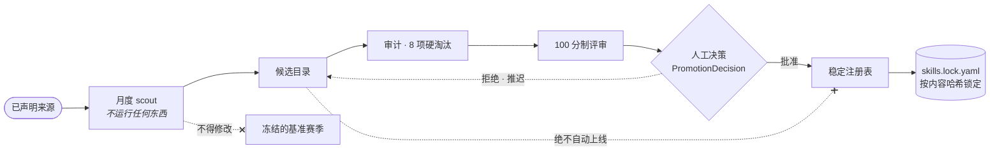

<div align="center">

# TCMScience

### 全球首个面向中医药与生物医学科学发现的受治理自主科研智能体

*The first governed autonomous research agent for Traditional Chinese Medicine*

**让语言模型推理，但不让它定义实验室的法则。**

<br>

**康砚澜**<sup>1,†</sup> &nbsp;·&nbsp;
**刘瑞琦**<sup>2,†</sup> &nbsp;·&nbsp;
**许帅**<sup>3,\*</sup> &nbsp;·&nbsp;
**张绪坤**<sup>4,\*</sup> &nbsp;·&nbsp;
[**朱正忠**](https://www.sciopen.com/scholar/info?id=1952658822209773569)<sup>5,\*</sup>

<sub>
<sup>1</sup>医学哲学与未来人工智能研究所（IMPF-AI） &nbsp;
<sup>2</sup>复旦大学上海医学院 &nbsp;
<sup>3</sup>上海自然尔然中医药基金会<br>
<sup>4</sup>香港大学李嘉诚医学院 &nbsp;
<sup>5</sup>福耀科技大学<br>
<sup>†</sup>同等贡献 &nbsp; <sup>*</sup>共同通讯作者
</sub>

<br><br>

[**项目主页**](https://psknlr.github.io/TCMScience/) &nbsp;|&nbsp;
[**评测平台 Arena**](https://psknlr.github.io/TCMScience/arena/) &nbsp;|&nbsp;
**论文** *（撰写中）* &nbsp;|&nbsp;
[**设计规范**](BioScience-Harness/docs/THIRD_PARTY_DB_CONNECTOR_SPEC.md) &nbsp;|&nbsp;
[**引用**](#引用) &nbsp;|&nbsp;
[**English**](README.md)

[](https://github.com/psknlr/TCMScience/actions/workflows/ci.yml)
[](https://opensource.org/licenses/MIT)
[](https://www.python.org/downloads/)


</div>

<p align="center">
  
</p>

## 摘要

中医药的证据种类差异极大：一段《伤寒论》条文、一条药典记载、一个对接分数、一次细胞实验、一项随机对照试验。把它们一律当作「证据文本」的语言模型智能体，迟早会把古籍记载说成临床发现，把网络预测说成作用机制。**TCMScience** 的做法是让这种错误**无法表达**，而不是靠提示词劝阻。模型负责规划和推理；独立的**可信内核**决定它能运行什么，在入口给每条数据打标签，并且只有当证据足以*支撑*某类主张时，才放行这条科学主张。智能体读取的每个数据集都是**内容哈希快照**，记录在哈希链账本中，因此每个结果都能指明它来自哪一份数据。用于经典方剂葛根芩连汤时，系统复现了常见的网络药理学结论，随后证明它是「哪些蛋白被检测过」造成的假象。剩下的是一个细胞色素 P450 抑制信号：它关乎中药—药物相互作用，而不是疗效。

## 主要贡献

| | 贡献 | 防止什么 |
|:-:|---|---|
| **1** | **证据种类是类型，不是等级。** 存储的是研究设计，证据等级由它推导。 | 细胞实验和动物实验被压成同一个「临床前」；古籍记载被当成临床证据。 |
| **2** | **计算预测在结构上无法变成事实。** 预测性研究设计只能支撑「机制假说」，由内核的主张—支撑表强制执行。 | 把网络药理学输出写成「作用机制」。 |
| **3** | **数据以可审计的快照进入。** 解析 → 标准化 → 质量门 → 内容哈希 → 账本；每个数据源都有一张写明许可和访问条件的卡片。 | 结果说不清来自哪个数据库的哪个版本。 |
| **4** | **Skill、数据源与评测基准各自独立版本化**；月度更新能发现新 Skill，但不能让它上线。 | 本月分数与上月不可比；未经审查的 Skill 自动上线。 |

## 主要结果：葛根芩连汤案例

用随包的网络药理学 Skill 在公开数据上对这首方剂（按《伤寒论》记载：葛根、黄芩、黄连、甘草）做了完整分析。数据来源：组成用 NPASS、CMAUP、LOTUS；活性用整理的实测效价和 PubChem BioAssay；生物学用 Reactome、STRING；适应症用 Open Targets。四味药的标志成分（葛根素、黄芩苷、小檗碱、甘草酸）在三个组成数据源中全部找到。

**1 · 常见的富集结论可以用「检测覆盖」解释。** 1,792 个成分；391 个人类蛋白有实测效价，其中 237 个 ≤ 10 µM。

| 通路富集的背景 | 蛋白 | 检验的通路 | 显著（BH + 度匹配零分布） |
|---|---:|---:|---:|
| 全部人类 Reactome 注释（常见做法） | 12,155 | 1,684 | **66** |
| 实际被检测过的蛋白（默认） | 391 | 959 | **0** |

「二氧化碳可逆水合」通路的 12 个蛋白全都被测过，其中 11 个命中。这些通路显得显著，是因为被测过，而不是因为被选择性地命中。「实测背景」本身的检验功效也很低：61% 的被测蛋白被记为命中，因为数据库很少收录阴性结果。

**2 · 纳入阴性结果后，只剩一个信号：CYP 抑制。** PubChem BioAssay 提供 143,702 条检测结果（10,710 条有活性，132,992 条无活性）。在测过 ≥ 20 个成分的 116 个蛋白上（12,579 次检测，8.6% 有活性），通过检验的是细胞色素 P450 通路（10,000 次置换，q = 0.023–0.026）；阈值为 ≥ 50 时同样如此（q = 0.017）。信号来自 Tox21 等统一检测面板中的 **CYP1A2**（205 个成分中 136 个有活性）和 **CYP2C9**（206 个中 78 个）。这是**中药—药物相互作用信号**，不是作用机制的证据。阈值放宽到 ≥ 10 时，通过的变成碳酸酐酶通路，那是少量按阳性挑选的文献检测造成的。

**3 · 与疾病的重叠取决于「疾病基因」怎么定义。** 实测靶点与 2 型糖尿病基因（Open Targets 26.06）：

| 疾病基因集 | 重叠 | 倍数 | p |
|---|---:|---:|---:|
| 人类遗传关联，分数 ≥ 0.5（默认） | 9 | 0.95 | 0.61 |
| 文献共现，分数 ≥ 0.5 | 58 | 5.34 | 7.7 × 10⁻²⁷ |

用文献定义得到的富集是循环论证：成分—靶点数据和文本挖掘研究的是同一批热门蛋白。所以流程默认使用遗传证据，选用文献时会给出警告。完整方法、敏感性分析与局限见[设计规范](BioScience-Harness/docs/THIRD_PARTY_DB_CONNECTOR_SPEC.md)。

## 证据治理

<p align="center">
  
</p>

这张图直接由内核强制执行的 `psh.workflow.compiler._SUPPORTS` 表生成（[生成脚本](docs/assets/make_figures.py)）。同一条规则执行三次：
1. **编译时。** 某个 Skill 的步骤支撑不了它声明的主张类型，就被拒绝（`EVIDENCE103`）。
2. **主张检查时。** 引用的每一条证据都必须能支撑该主张类型，按最弱一环判定（`CLM005`）。
3. **发布前。** 只有当主张路径上的每条边都存在于已校验的快照中，才能发布；同时记录这条路径最多能支撑哪一类主张，以及为什么只能停在这里。

过度主张是*可以构造出来的*，会以专门的错误码被拒绝：一个连过度主张都表示不出来的系统，也就测不出过度主张。

## 快速开始

不需要安装、配置、API key，也不联网：

```bash
cd BioScience-Harness && python examples/run_skills.py
# … 5/5 artifacts passed the publication gate
```

作为库安装（Python ≥ 3.11）。`[test]` 不能省：少了 `hypothesis`，PSH 有 11 个测试模块会被静默跳过。

```bash
pip install -e "PSH-Harness[test]"          # 可信内核
pip install -e "BioScience-Harness[dev]"    # 能力平面 + 治理层
```

```python
from bioagent.skills.p0 import assess_tcm_safety
from bioagent.contracts import validate_artifact

artifact = assess_tcm_safety("甘草", co_administered=["甘遂"])   # 十八反
verdict = validate_artifact(artifact)
print(artifact.composite_version_string)   # 运行时 · Skill · 数据源 · 基准
print(verdict.publishable, verdict.codes)
```

<details>
<summary><b>命令行、网络药理学流程与测试</b></summary>

```bash
# 列出并运行 Skill
python -m bioagent.cli skills --dir BioScience-Harness/skills/tcm
python -m bioagent.cli skill normalize-tcm-entities --arg names=姜,白芍 --dir BioScience-Harness/skills/tcm

# 葛根芩连汤案例（原始文件取自各数据源的下载页）
cd BioScience-Harness
python scripts/build_source_snapshots.py gold --network --raw RAW --out SNAP --ledger SNAP/audit/snapshots.jsonl
python scripts/fetch_opentargets.py MONDO_0005148 --raw RAW
python scripts/fetch_pubchem.py --composition SNAP/composition.json --raw RAW
python scripts/run_network_pharmacology.py --snapshots SNAP --ledger SNAP/audit/snapshots.jsonl --out RUN
python scripts/run_network_pharmacology.py ... --hits screening          # PubChem，含阴性结果

# 测试：PSH 961 · BioScience 949
cd PSH-Harness        && PYTHONPATH=src python -m pytest -q
cd BioScience-Harness && PYTHONPATH=src:../PSH-Harness/src python -m pytest -q -m unit
```

更多见 [INSTALL.md](INSTALL.md) 与 [USAGE.md](USAGE.md)。
</details>

## 架构

大语言模型不应同时是自己的规划器、执行器、安全策略、证据裁判和发布权威。因此 TCMScience 分为三个平面（见上图）：

- **可信内核（[PSH-Harness](PSH-Harness)）**：在入口给数据打标签，每个请求都与策略格求交，把计划编译成有类型、有边界的程序，所有模型、工具和委派调用都经过同一个网关，输出在发布前隔离。审计记录是哈希链。
- **能力平面（[BioScience-Harness](BioScience-Harness)）**：58 个已验证的公共数据源（153 个带类型的操作）、12 个领域的 147 个原生工具、有类型的中医药层（药材、炮制、带君臣佐使的方剂、证候、经典条文、十八反），以及数据快照层。
- **治理层**：编译为内核程序的 Skill 清单、带校验器的数据契约、按内容哈希锁定的注册表，以及评测基准框架。

### Skill

| Skill | 它拒绝做什么 |
|---|---|
| `normalize-tcm-entities` | 在名称有歧义时替你选：「姜」可能是生姜或干姜，是两味不同的药。 |
| `retrieve-tcm-evidence` | 下判断：空结果不等于「无效」，未评估的偏倚保持 `NOT_ASSESSED`。 |
| `analyze-tcm-network-pharmacology` | 混淆预测与实测：预测靶点和实测靶点分开存放，只提出机制*假说*。 |
| `assess-tcm-safety` | 回答「安全」：没有记录不等于安全；十八反按药对组合检查。 |
| `tcm.network-pharmacology` | 不带对照地报告富集：在账本校验过的快照上运行上面的案例，并写出完整溯源。 |

### 数据源

每个数据源都有一张卡片，写明许可和访问方式。网页访问默认关闭，需要人工批准；Skill 只能缩小自己可用的数据源，不能扩大。

| 数据源 | 提供 | 许可 |
|---|---|---|
| NPASS 2.0 · CMAUP 2.0 | 组成、实测活性 | 学术免费使用 |
| LOTUS（冻结导出） | 组成 | CC BY 4.0 |
| BindingDB | 实测结合 | CC BY 4.0 |
| PubChem BioAssay | 筛选结果，含阴性 | NCBI 数据政策 |
| STRING v12 | 蛋白关联 | CC BY 4.0 |
| Reactome | 通路成员 | CC0 |
| Open Targets 26.06 | 靶点—疾病关联 | CC0 |

## TCMScience Arena 评测平台

只读的公开评测站点（[在线](https://psknlr.github.io/TCMScience/arena/)，[源码](arena/web)）。它**只渲染结果，从不计算分数**，所以改动站点也改不了结果。包含六个赛道（实体、证据、网络药理、安全、试验审计、端到端），八个评分维度始终分项展示。被硬门槛拦下的运行仍显示在实验榜上。评测用例和标准答案不随代码发布，`scripts/check_leakage.py` 负责检查没有泄漏。

<details>
<summary><b>月度 Skill 发现：能发现，不能上线</b></summary>



架构决策：[0001](docs/adr/0001-three-registry-separation.md) 注册表分离 ·
[0002](docs/adr/0002-independent-version-axes.md) 独立版本轴 ·
[0003](docs/adr/0003-skill-yaml-compilation-contract.md) `skill.yaml` 是编译契约 ·
[0004](docs/adr/0004-arena-read-only-static-first.md) Arena 只读。
</details>

<details>
<summary><b>仓库结构</b></summary>

```text
TCMScience/
├── PSH-Harness/                  可信内核：权限 · 出口 · 隔离 · 发布 · 工作流 IR
├── BioScience-Harness/
│   ├── src/bioagent/
│   │   ├── sources/              数据源卡片 · 解析器 · 快照 · 账本 · 发布检查
│   │   ├── analysis/             基于已校验快照的网络药理学
│   │   ├── contracts/            证据 · 主张 · 产物 · 质量校验
│   │   ├── skills/               清单加载 · 编译 · 四个 P0 Skill
│   │   ├── updates/ benchmarks/  注册表、scout、评测框架
│   │   └── tcm/                  有类型的中医药知识 + 种子语料
│   ├── skills/tcm/               skill.yaml + SKILL.md
│   └── registry/                 锁定文件与发布记录
├── arena/web/                    只读评测站点
├── site/                         项目主页
└── docs/                         架构决策、图及其生成脚本
```
</details>

## 我们不声称什么

TCMScience **不**声称对提示注入有通用免疫力，**不**声称认证级去标识化，**不**声称执行环境不可篡改：
- 进程内运行的组件没有隔离，出口代理只约束遵守它的客户端。
- 随包的沙箱后端是空实现，并且它自己这么说。
- 审计链能*察觉*篡改，不能防止篡改。

真正的隔离需要容器运行时或操作系统级沙箱。上面每个分析结果都附有局限说明；「不显著」不等于「无关」。

## 引用

```bibtex
@software{kang2026tcmscience,
  title  = {TCMScience: A Governed Autonomous Research Agent for Traditional Chinese Medicine},
  author = {Kang, Yanlan and Liu, Ruiqi and Xu, Shuai and Zhang, Xukun and Chu, William Cheng-Chung},
  year   = {2026},
  url    = {https://github.com/psknlr/TCMScience},
  note   = {Open-source research software}
}
```

<div align="center">
<sub>

以 [MIT 许可证](https://opensource.org/licenses/MIT) 发布。上游数据保留各自的许可（见数据源卡片）。<br>
**从经典知识到可验证证据。** *From classical knowledge to testable evidence.*

</sub>
</div>
