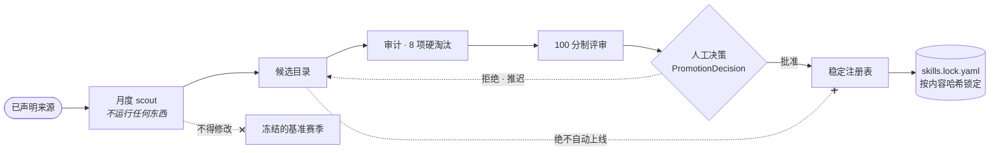

<div align="center">

# TCMScience

### 全球首个面向中医药与生物医学科学发现的受治理自主科研智能体

*The first governed autonomous research agent for Traditional Chinese Medicine*

**让语言模型推理，但不让它定义实验室的法则。**

<br>

**康砚澜**<sup>1,†</sup> &nbsp;·&nbsp;
**刘瑞琦**<sup>2,†</sup> &nbsp;·&nbsp;
**许帅**<sup>3,\*</sup> &nbsp;·&nbsp;
**张绪坤**<sup>4,\*</sup> &nbsp;·&nbsp;
[**朱正忠**](https://www.sciopen.com/scholar/info?id=1952658822209773569)<sup>5,\*</sup>

<sub>
<sup>1</sup>医学哲学与未来人工智能研究所（IMPF-AI） &nbsp;
<sup>2</sup>复旦大学上海医学院 &nbsp;
<sup>3</sup>上海自然尔然中医药基金会<br>
<sup>4</sup>香港大学李嘉诚医学院 &nbsp;
<sup>5</sup>福耀科技大学<br>
<sup>†</sup>同等贡献 &nbsp; <sup>*</sup>共同通讯作者
</sub>

<br><br>

[**项目主页**](https://psknlr.github.io/TCMScience/) &nbsp;|&nbsp;
[**评测平台 Arena**](https://psknlr.github.io/TCMScience/arena/) &nbsp;|&nbsp;
**论文** *（撰写中）* &nbsp;|&nbsp;
[**设计规范**](BioScience-Harness/docs/THIRD_PARTY_DB_CONNECTOR_SPEC.md) &nbsp;|&nbsp;
[**引用**](#引用) &nbsp;|&nbsp;
[**English**](README.md)

[](https://github.com/psknlr/TCMScience/actions/workflows/ci.yml)
[](https://opensource.org/licenses/MIT)
[](https://www.python.org/downloads/)


</div>

<p align="center">
  
</p>

## 摘要

中医药的证据种类差异极大：一段《伤寒论》条文、一条药典记载、一个对接分数、一次细胞实验、一项随机对照试验。把它们一律当作「证据文本」的语言模型智能体，迟早会把古籍记载说成临床发现，把网络预测说成作用机制。**TCMScience** 的做法是让这种错误**无法表达**，而不是靠提示词劝阻。模型负责规划和推理；独立的**可信内核**决定它能运行什么，在入口给每条数据打标签，并且只有当证据足以*支撑*某类主张时，才放行这条科学主张。智能体读取的每个数据集都是**内容哈希快照**，记录在哈希链账本中，因此每个结果都能指明它来自哪一份数据。用于经典方剂葛根芩连汤时，系统复现了常见的网络药理学结论，随后证明它是「哪些蛋白被检测过」造成的假象。剩下的是一个细胞色素 P450 抑制信号：它关乎中药—药物相互作用，而不是疗效。

架构好不好，要看它是否改变了被发布的内容，所以这一点也做了测量。我们把同样 117 个含错误的输出送进真实闸门的每一种组合：只有内核时放行 5 个，只有领域层时放行 57 个，完整治理时一个也不放行，并且没有任何组合拒绝正确输出。下一步做哪个分析、何时停止，也按发布的方式决定：模型提出解释及其预测，学到了什么由内核判定。

## TCMScience 是什么，不是什么

TCMScience 主要不是一个「工具多」的生物医学智能体。它是一个**受治理的科研运行时**：计算行为、证据、主张和发布权限各自有类型，各自独立于提出它们的模型受控，并原生支持中医药。

生物医学科研智能体的发力点各不相同。TCMScience 的重心在下表的最后两层，目标是与其他层衔接，而不是比拼广度。

| 层 | 回答的问题 | 已发表系统的发力点 | TCMScience |
|---|---|---|---|
| 工具 | 智能体能调用什么？ | [ToolUniverse](https://github.com/mims-harvard/ToolUniverse)：1,000 多个模型、数据集、API 和科学软件包，68 个预置科研流程（README，2026 年 10 月） | 58 个公共数据源、153 个带类型的操作、147 个原生工具，每个都有数据源卡片 |
| 行动 | 如何把工具组合成研究？ | [Biomni](https://doi.org/10.1126/science.adz4351)（*Science*，2026）：取自 25 个生物医学子领域的 150 个工具、59 个数据库、105 个软件包；工具检索、规划、代码执行 | 计划在运行之前编译成有类型、有边界的程序 |
| 认知 | 如何探索、如何决策？ | [DeepEvidence](https://doi.org/10.1038/s42256-026-01266-0)（*Nat. Mach. Intell.*，2026）：在证据图上做广度优先与深度优先研究 · [BioMedAgent](https://doi.org/10.1038/s41551-026-01634-6)（*Nat. Biomed. Eng.*，2026）：327 项数据分析任务完成 77% · [BioDiscoveryAgent](https://proceedings.iclr.cc/paper_files/paper/2025/hash/4252dc94531833029000f85dc5fac792-Abstract-Conference.html)（ICLR 2025）：闭环设计基因扰动实验 | 基于预先封存的预测的推理引擎（[见下文](#下一步该查什么)）；新近加入，只在人工世界上检验过 |
| **认识论** | 这条证据能支撑什么？ | 对收集到的证据做追踪、溯源和核验 | **研究设计是类型；内核强制执行的同一张表规定每种设计能许可哪些主张，在编译时、主张检查时和发布前各执行一次** |
| **治理** | 什么能运行、能保存、能发布？凭谁的授权？ | 交给部署环境：Biomni 的 README 要求放在隔离环境中运行，因为它的智能体以完整系统权限执行生成的代码 | **可信内核：权限只能收窄，数据入口即打标签，所有调用经同一网关，隔离区，发布闸门，哈希链审计** |

**别人更强的地方。**
- 工具、数据库和软件的广度（ToolUniverse、Biomni）。
- 湿实验流程和多组学流程。
- 已在真实筛选数据上运行过的闭环实验设计（BioDiscoveryAgent）。
- 最重要的是：在公开任务基准上、经同行评议的验证（Biomni、BioMedAgent、DeepEvidence）。TCMScience 的六赛道 Arena 目前是评测设计加演示运行，还不是完成的验证。

**目前改为测量的东西。**
- 治理是否改变了智能体发布的内容（[治理消融](#治理值不值得)）。
- 在已知答案的人工世界里，推理引擎能否找到真正的解释（[人工世界](#下一步该查什么)）。

[BiomniBench](https://doi.org/10.64898/2026.05.12.724604) 报告：智能体的运行框架对分数的影响可以超过模型换代，这正是研究运行框架本身的理由。这套架构还欠一个比较：在公开任务基准上，用同一模型、同一工具、同一任务，有它与没有它各跑一次。

## 主要贡献

| | 贡献 | 防止什么 |
|:-:|---|---|
| **1** | **证据种类是类型，不是等级。** 存储的是研究设计，证据等级由它推导。 | 细胞实验和动物实验被压成同一个「临床前」；古籍记载被当成临床证据。 |
| **2** | **计算预测在结构上无法变成事实。** 预测性研究设计只能支撑「机制假说」，由内核的主张—支撑表强制执行。 | 把网络药理学输出写成「作用机制」。 |
| **3** | **数据以可审计的快照进入。** 解析 → 标准化 → 质量门 → 内容哈希 → 账本；每个数据源都有一张写明许可和访问条件的卡片。 | 结果说不清来自哪个数据库的哪个版本。 |
| **4** | **Skill、数据源与评测基准各自独立版本化**；月度更新能发现新 Skill，但不能让它上线。 | 本月分数与上月不可比；未经审查的 Skill 自动上线。 |
| **5** | **信念只按预先封存的预测移动。** 模型提出竞争解释及各自的预测；下一个分析由内核按信息增益挑选，信念也由内核更新。只有在严格检验并完成重复之后才停止。 | 一直做印证性分析，直到故事说圆；对接结果改变了对临床疗效的信念；把后验概率当作许可。 |
| **6** | **治理是测出来的，不是宣称的。** 117 个含错误的输出经过真实闸门的每种组合：无治理时全部放行，完整治理时全部拦下，没有误拒正确输出；基准发现的每个漏洞都在运行时检查中补上了。 | 只凭架构图评判架构。 |

## 治理值不值得？

只有同样的输出经过它之后科学错误更少，架构才算优势。[治理消融](docs/governance-ablation.md)的做法：
- 取 10 个审稿人会放行的输出。
- 每次注入一种已知错误，共得到 25 类 117 个变异体。例如：研究没纳入的人群、拿对接分数论证疗效、白附子冒充附子、剂量错读 10 倍、被篡改或凭空捏造的引用、用计划从句掩护「治愈」；以及四类中医药特有的错误：单一成分的证据推到整方、制附子的证据用于生附子、把体外结果说成人体浓度下成立、同一试验被算成两项。
- 送进运行时真实的闸门，逐一开关各部分。

| 配置 | 放行的错误（95% 置信区间） | 误拒的正确输出 |
|---|---:|---:|
| 无治理 | 117/117 · 100%（97–100%） | 0/10 |
| 仅领域层 | 57/117 · 49%（40–58%） | 0/10 |
| 仅内核 | 5/117 · 4%（2–10%） | 0/10 |
| **完整治理** | **0/117 · 0%（0–3%）** | **0/10** |

各层互不冗余。单独关掉某个闸门后，多放行的错误：

| 关掉的闸门 | 多放行 | 是哪些错误 |
|---|---:|---|
| 输出闸门 | 42 | 方向反转、正文偏离结构化主张、剂量错读 10 倍、捏造引用、错引条文 |
| 证据摄入时的签名复核 | 10 | 10 条被篡改的记录，其中包括一条《伤寒论》条文 |
| 主张契约 | 4 | 同一试验被算成两项（两例）、正文里的近名药、把体外结果说成人体浓度下成立 |
| 发布路径检查 | 1 | 借来的作用方向 |
| 许可检查 | 0 | 没有其他闸门拦不住的 |

- **两轮修补：** 完整治理放行的错误从 19 降到 10，再降到 0。每个漏洞都由基准发现，并在运行时检查里补上，而不是改基准：
  - 每个句子里的引用都要核查；
  - 心血管死亡与全因死亡分开；
  - 中文关联句的主语能被识别；
  - 机制句须得到所引记录的支持；
  - 《伤寒论》条文按记录编号引用并核查，引文须与原文一致；
  - 新增四项中医药领域检查（CLM015–CLM018）。
- **这些数字的性质：** 它们是有明确构造的回归基准数字，不是真实场景的错误率，因为用例和变异算子都由闸门的作者编写。没有漏网者，说明这个基准已不再有区分力，此后用于防止回退；要发现新的漏洞，需要由审稿人标注的真实输出。CI 会拒绝任何回退。

## 下一步该查什么

内核决定智能体能运行什么、发布的主张能说什么。两者之间还有自主科研最常做的决定：下一步做哪个分析、结果让信念移动多少、何时可以停。`psh.scientist.inquiry` 把它们变成对预先承诺的计算（[文档](docs/inquiry.md)）：
- **模型提出：** 竞争解释、显式的「以上皆非」兜底项，以及每个解释对每个分析结果的预测。所有预测在任何分析运行之前封存。
- **内核挑选并更新：** 挑选单位成本期望信息量最大的分析，只用封存的预测更新信念。分析的研究设计许可不了某个解释的主张类型时，这个解释的概率保持不动，例如对接结果改变不了对疗效的信念。
- **接受条件：** 领先解释必须对每个存活的对手通过严格检验，并且完成重复。结论强度由许可表封顶，而不是由后验概率决定。审计轨迹可以重放出同样的信念。

我们把它用于葛根芩连汤的一个通路信号，问题是：这个信号来自方剂的活性、来自哪些蛋白被检测过，还是来自化合物的「滥交」性？在三个答案已知的人工世界上检验：

| 世界 | 真正的解释 | 结论 | 发布的机制主张 | 网络药理运行次数 |
|---|---|---|---:|---:|
| selective | 方剂的活性 | 接受；试探性的机制假说 | 1 | 67 次中的 45 次 |
| coverage | 哪些蛋白被检测过 | 接受；一个关于分析本身的发现 | 0 | 67 次中的 14 次 |
| promiscuous | 化合物的「滥交」性 | 接受；一个关于分析本身的发现 | 0 | 67 次中的 45 次 |

在任何分析运行之前，常规分析（以全部 Reactome 注释为背景的富集）只值 0.06 比特，因为每个解释都预测它会富集；以实测蛋白为背景的富集值 0.43 比特。

人工世界只展示机制，不证明引擎能正确判断真实问题。

## 主要结果：葛根芩连汤案例

用随包的网络药理学 Skill 在公开数据上对这首方剂（按《伤寒论》记载：葛根、黄芩、黄连、甘草）做了完整分析。数据来源：组成用 NPASS、CMAUP、LOTUS；活性用整理的实测效价和 PubChem BioAssay；生物学用 Reactome、STRING；适应症用 Open Targets。四味药的标志成分（葛根素、黄芩苷、小檗碱、甘草酸）在三个组成数据源中全部找到。

**1 · 常见的富集结论可以用「检测覆盖」解释。** 1,792 个成分；391 个人类蛋白有实测效价，其中 237 个 ≤ 10 µM。

| 通路富集的背景 | 蛋白 | 检验的通路 | 显著（BH + 度匹配零分布） |
|---|---:|---:|---:|
| 全部人类 Reactome 注释（常见做法） | 12,155 | 1,684 | **66** |
| 实际被检测过的蛋白（默认） | 391 | 959 | **0** |

「二氧化碳可逆水合」通路的 12 个蛋白全都被测过，其中 11 个命中。这些通路显得显著，是因为被测过，而不是因为被选择性地命中。「实测背景」本身的检验功效也很低：61% 的被测蛋白被记为命中，因为数据库很少收录阴性结果。

**2 · 纳入阴性结果后，信号落在药物代谢酶上。** PubChem BioAssay 提供 143,679 条检测结果，涉及 1,029 个人类蛋白（10,696 条有活性，132,983 条无活性）。在测过 ≥ 20 个成分的 472 个蛋白上（51,304 次检测，6.5% 有活性），有 9 条通路通过检验（10,000 次置换，q = 0.008–0.026）。其中 6 条是由细胞色素 P450 承载的药物代谢通路（外源物代谢、EET/DHET 与 16-20-HETE 合成、类 maresin SPM 合成、阿司匹林 ADME、CYP2E1 反应），其中 5 条在 ≥ 10、20、50 三个阈值下都通过。信号来自 Tox21、qHTS 等统一检测面板：**CYP1A2**（205 个成分中 136 个有活性）、**CYP2C19**（204 中 91）、**CYP2C9**（206 中 78）、**CYP2D6**（204 中 75）和 **CYP3A4**（224 中 70）。这是**中药—药物相互作用信号**，不是作用机制的证据。核受体转录通路也通过了（22 个核受体，16.9% 的检测有活性）：ESR1 的活性以激动模式为主（黄酮与异黄酮，符合植物雌激素的性质），AR、PPARG、THRB 的活性则主要来自拮抗模式的报告基因检测，易受细胞毒性和荧光素酶抑制干扰。碳酸酐酶通路在较低阈值下通过，但依据的是少量按阳性挑选的文献检测（121 次检测中 116 次有活性），阈值 ≥ 50 时消失。

*2026-09-30 更正*：此前这里的数字把 PubChem 四分之三的基因号映射到了其他数据源都不用的 UniProt 号，CYP3A4 等蛋白因此在检验中悄悄消失（见[复核文档](BioScience-Harness/docs/REVIEW_2026-09-30_THIRD_PARTY_DATA.md) §7）。

**3 · 与疾病的重叠取决于「疾病基因」怎么定义。** 实测靶点与 2 型糖尿病基因（Open Targets 26.09）：

| 疾病基因集 | 重叠 | 倍数 | p |
|---|---:|---:|---:|
| 人类遗传关联，分数 ≥ 0.5（默认） | 9 | 0.97 | 0.59 |
| 文献共现，分数 ≥ 0.5 | 57 | 5.26 | 5.2 × 10⁻²⁶ |

用文献定义得到的富集是循环论证：成分—靶点数据和文本挖掘研究的是同一批热门蛋白。所以流程默认使用遗传证据，选用文献时会给出警告。完整方法、敏感性分析与局限见[设计规范](BioScience-Harness/docs/THIRD_PARTY_DB_CONNECTOR_SPEC.md)。

## 证据治理

<p align="center">
  
</p>

这张图直接由内核强制执行的 `psh.workflow.compiler._SUPPORTS` 表生成（[生成脚本](docs/assets/make_figures.py)）。同一条规则执行三次：
1. **编译时。** 某个 Skill 的步骤支撑不了它声明的主张类型，就被拒绝（`EVIDENCE103`）。
2. **主张检查时。** 引用的每一条证据都必须能支撑该主张类型，按最弱一环判定（`CLM005`）。
3. **发布前。** 只有当主张路径上的每条边都存在于已校验的快照中，才能发布；同时记录这条路径最多能支撑哪一类主张，以及为什么只能停在这里。

过度主张是*可以构造出来的*，会以专门的错误码被拒绝：一个连过度主张都表示不出来的系统，也就测不出过度主张。

## 快速开始

不需要安装、配置、API key，也不联网：

```bash
cd BioScience-Harness && python examples/run_skills.py
# … 5/5 artifacts passed the publication gate
```

作为库安装（Python ≥ 3.11）。`[test]` 不能省：少了 `hypothesis`，PSH 有 11 个测试模块会被静默跳过。

```bash
pip install -e "PSH-Harness[test]"          # 可信内核
pip install -e "BioScience-Harness[dev]"    # 能力平面 + 治理层
```

```python
from bioagent.skills.p0 import assess_tcm_safety
from bioagent.contracts import validate_artifact

artifact = assess_tcm_safety("甘草", co_administered=["甘遂"])   # 十八反
verdict = validate_artifact(artifact)
print(artifact.composite_version_string)   # 运行时 · Skill · 数据源 · 基准
print(verdict.publishable, verdict.codes)
```

<details>
<summary><b>命令行、网络药理学流程与测试</b></summary>

```bash
# 列出并运行 Skill
python -m bioagent.cli skills --dir BioScience-Harness/skills/tcm
python -m bioagent.cli skill normalize-tcm-entities --arg names=姜,白芍 --dir BioScience-Harness/skills/tcm

# 葛根芩连汤案例（原始文件取自各数据源的下载页）
cd BioScience-Harness
python scripts/build_source_snapshots.py gold --network --raw RAW --out SNAP --ledger SNAP/audit/snapshots.jsonl
python scripts/fetch_opentargets.py MONDO_0005148 --raw RAW
python scripts/build_source_snapshots.py opentargets --file RAW/opentargets_MONDO_0005148.json --out SNAP --ledger SNAP/audit/snapshots.jsonl
python scripts/fetch_pubchem.py --composition SNAP/composition.json --raw RAW
python scripts/build_source_snapshots.py pubchem --file RAW/pubchem_bioassay.json.gz --raw RAW --out SNAP --ledger SNAP/audit/snapshots.jsonl
python scripts/run_network_pharmacology.py --snapshots SNAP --ledger SNAP/audit/snapshots.jsonl --out RUN
python scripts/run_network_pharmacology.py ... --hits screening          # PubChem，含阴性结果

# 治理消融，以及在已知答案的世界上运行推理引擎
python scripts/run_governance_ablation.py --out RUN/ablation              # docs/governance-ablation.md
python scripts/run_inquiry.py --planted all --out RUN/inquiry              # docs/inquiry.md

# 从 FASTQ 到差异表达报告的 RNA-seq 流程（docs/analysis-pipelines.md）
python -m bioagent.cli rnaseq --samples samples.csv --transcripts tx.fa --annotation genes.gtf --out results/

# 测试：PSH 1248 · BioScience 1990（单元层）
cd PSH-Harness        && PYTHONPATH=src python -m pytest -q
cd BioScience-Harness && PYTHONPATH=src:../PSH-Harness/src python -m pytest -q -m unit
```

更多见 [INSTALL.md](INSTALL.md) 与 [USAGE.md](USAGE.md)。
</details>

## 架构

大语言模型不应同时是自己的规划器、执行器、安全策略、证据裁判和发布权威。因此 TCMScience 分为三个平面（见上图）：

- **可信内核（[PSH-Harness](PSH-Harness)）**：在入口给数据打标签，每个请求都与策略格求交，把计划编译成有类型、有边界的程序，所有模型、工具和委派调用都经过同一个网关，输出在发布前隔离。审计记录是哈希链。
- **科学家平面（[psh.scientist](PSH-Harness/src/psh/scientist)）**：
  - 假说、预注册方案和观察都是带内容哈希的记录。
  - 世界模型记录哪些解释相互竞争、哪些观察涉及哪个解释。
  - 推理引擎在封存的预测上按信息增益选择下一个分析，并决定项目何时可以停止。
- **能力平面（[BioScience-Harness](BioScience-Harness)）**：58 个已验证的公共数据源（153 个带类型的操作）、12 个领域的 147 个原生工具、有类型的中医药层（药材、炮制、带君臣佐使的方剂、证候、经典条文、十八反），以及数据快照层。
- **治理层**：编译为内核程序的 Skill 清单、带校验器的数据契约、按内容哈希锁定的注册表，以及评测基准框架。

### Skill

| Skill | 它拒绝做什么 |
|---|---|
| `normalize-tcm-entities` | 在名称有歧义时替你选：「姜」可能是生姜或干姜，是两味不同的药。 |
| `retrieve-tcm-evidence` | 下判断：空结果不等于「无效」，未评估的偏倚保持 `NOT_ASSESSED`。 |
| `analyze-tcm-network-pharmacology` | 混淆预测与实测：预测靶点和实测靶点分开存放，只提出机制*假说*。 |
| `assess-tcm-safety` | 回答「安全」：没有记录不等于安全；十八反按药对组合检查。 |
| `tcm.network-pharmacology` | 不带对照地报告富集：在账本校验过的快照上运行上面的案例，并写出完整溯源。 |

### 分析流程

一次调用就能把你自己的数据走完一条完整分析，每个参数、工具版本和文件摘要都会被记录（[docs/analysis-pipelines.md](docs/analysis-pipelines.md)）。封装这些流程的 Skill 目前是候选：运行会被记录，但在有人晋级之前不会发布。

| 流程 | 它拒绝做什么 |
|---|---|
| `bioagent rnaseq` — FASTQ → 质控 → 修剪 → 定量 → DESeq2 → 报告 | 把表达差异说成机制或效应：人体样本只支持关联，细胞和动物样本只支持机制假说。 |
| `bioagent scrna` — 计数矩阵 → 质控 → 双细胞 → Harmony → Leiden → 标志基因 → 注释 → PAGA／拟时序 → 伪 bulk | 把按标志基因给出的标签当作测量，或把细胞当作重复：标签和拟时序是输出，不同条件按样本比较。 |
| `bioagent fold` — 序列 → ESMFold／AlphaFold2 → pLDDT、DSSP、几何检查 → 与参考结构比 TM-score | 把预测当作实测结构，或未经允许把序列发往任何地方：模型是带置信度的输出，远程预测需要 `--allow-remote`。 |
| `bioagent dock` — 受体 + 配体 → 准备好的 PDBQT → 再对接检验 → Vina 构象、打分、接触 | 把打分当作亲和力，或用没通过再对接检验的设置给构象排序：先验证；没有验证，就不下结论。 |
| `bioagent admet` — 结构 → 描述符、规则、警示结构 → 22 个按 TDC 训练的终点 | 把预测说成测量，或在模型没见过的化学空间里预测：每个终点都带留出集误差和适用域标记。 |

### 临床决策支持

`bioagent clinic` 把结构化的四诊记录转成辨证结果和一份处方草案，交由执业中医师接受、修改或拒绝（[docs/tcm-clinic.md](docs/tcm-clinic.md)）。它从不自行开具处方。

| 步骤 | 它拒绝做什么 |
|---|---|
| `bioagent clinic assess` — 四诊 → 危险信号 → 辨证 → 处方草案 | 越过危险信号继续、为急症证候拟方，或在辨证标准未满足时替人决定：它会建议转诊，或列出能够作出判断还需要的信息。 |
| `bioagent clinic sign` — 医师的决定 | 自己签字、在存在「停止」级问题时接受草案，或在「阻断」级问题没有医师记录理由时放行。 |

### 数据源

每个数据源都有一张卡片，写明许可和访问方式。网页访问默认关闭，需要人工批准；Skill 只能缩小自己可用的数据源，不能扩大。

| 数据源 | 提供 | 许可 |
|---|---|---|
| NPASS 2.0 · CMAUP 2.0 | 组成、实测活性 | 学术免费使用 |
| LOTUS（冻结导出） | 组成 | CC BY 4.0 |
| BindingDB | 实测结合 | CC BY 4.0 |
| PubChem BioAssay | 筛选结果，含阴性 | NCBI 数据政策 |
| STRING v12 | 蛋白关联 | CC BY 4.0 |
| UniProt（人类，已审阅） | Swiss-Prot 主号，用于映射 PubChem 的基因号 | CC BY 4.0 |
| Reactome | 通路成员 | CC0 |
| Open Targets 26.09 | 靶点—疾病关联 | CC0 |

## TCMScience Arena 评测平台

只读的公开评测站点（[在线](https://psknlr.github.io/TCMScience/arena/)，[源码](arena/web)）。它**只渲染结果，从不计算分数**，所以改动站点也改不了结果。包含六个赛道（实体、证据、网络药理、安全、试验审计、端到端），八个评分维度始终分项展示。被硬门槛拦下的运行仍显示在实验榜上。评测用例和标准答案不随代码发布，`scripts/check_leakage.py` 负责检查没有泄漏。

<details>
<summary><b>月度 Skill 发现：能发现，不能上线</b></summary>


```mermaid
flowchart LR
    SRC(["已声明来源"]) --> SCOUT["月度 scout<br/><i>不运行任何东西</i>"] --> CAND["候选目录"]
    CAND --> AUDIT["审计 · 8 项硬淘汰"] --> SCORE["100 分制评审"] --> HUMAN{"人工决策<br/>PromotionDecision"}
    HUMAN -->|批准| STABLE["稳定注册表"] --> LOCK[("skills.lock.yaml<br/>按内容哈希锁定")]
    HUMAN -.->|拒绝 · 推迟| CAND
    CAND -.-x|绝不自动上线| STABLE
    SCOUT -.-x|不得修改| SEASON["冻结的基准赛季"]
```

架构决策：[0001](docs/adr/0001-three-registry-separation.md) 注册表分离 ·
[0002](docs/adr/0002-independent-version-axes.md) 独立版本轴 ·
[0003](docs/adr/0003-skill-yaml-compilation-contract.md) `skill.yaml` 是编译契约 ·
[0004](docs/adr/0004-arena-read-only-static-first.md) Arena 只读。
</details>

<details>
<summary><b>仓库结构</b></summary>

```text
TCMScience/
├── PSH-Harness/                  可信内核：权限 · 出口 · 隔离 · 发布 · 工作流 IR
├── BioScience-Harness/
│   ├── src/bioagent/
│   │   ├── sources/              数据源卡片 · 解析器 · 快照 · 账本 · 发布检查
│   │   ├── analysis/             基于已校验快照的网络药理学
│   │   ├── research/             研究循环、通路推理、人工世界
│   │   ├── contracts/            证据 · 主张 · 产物 · 质量校验
│   │   ├── skills/               清单加载 · 编译 · 四个 P0 Skill
│   │   ├── updates/ benchmarks/  注册表、scout、评测框架、治理消融
│   │   └── tcm/                  有类型的中医药知识 + 种子语料
│   ├── skills/tcm/               skill.yaml + SKILL.md
│   ├── benchmarks/ablation/      CI 据以检查回退的消融结果
│   └── registry/                 锁定文件与发布记录
├── arena/web/                    只读评测站点
├── site/                         项目主页
└── docs/                         架构决策、图及其生成脚本
```
</details>

## 我们不声称什么

TCMScience **不**声称比 Biomni、ToolUniverse、DeepEvidence 或 BioMedAgent 能力更强：它的工具更少，自己的基准也还不是验证。它也**不**声称治理消融中的比率适用于真实的智能体输出：这些比率来自明确说明的构造。

TCMScience **不**声称对提示注入有通用免疫力，**不**声称认证级去标识化，**不**声称执行环境不可篡改：
- 进程内运行的组件没有隔离，出口代理只约束遵守它的客户端。
- 随包的沙箱后端是空实现，并且它自己这么说。
- 审计链能*察觉*篡改，不能防止篡改。

真正的隔离需要容器运行时或操作系统级沙箱。上面每个分析结果都附有局限说明；「不显著」不等于「无关」。

## 引用

```bibtex
@software{kang2026tcmscience,
  title  = {TCMScience: A Governed Autonomous Research Agent for Traditional Chinese Medicine},
  author = {Kang, Yanlan and Liu, Ruiqi and Xu, Shuai and Zhang, Xukun and Chu, William Cheng-Chung},
  year   = {2026},
  url    = {https://github.com/psknlr/TCMScience},
  note   = {Open-source research software}
}
```

<div align="center">
<sub>

以 [MIT 许可证](https://opensource.org/licenses/MIT) 发布。上游数据保留各自的许可（见数据源卡片）。<br>
**从经典知识到可验证证据。** *From classical knowledge to testable evidence.*

</sub>
</div>
